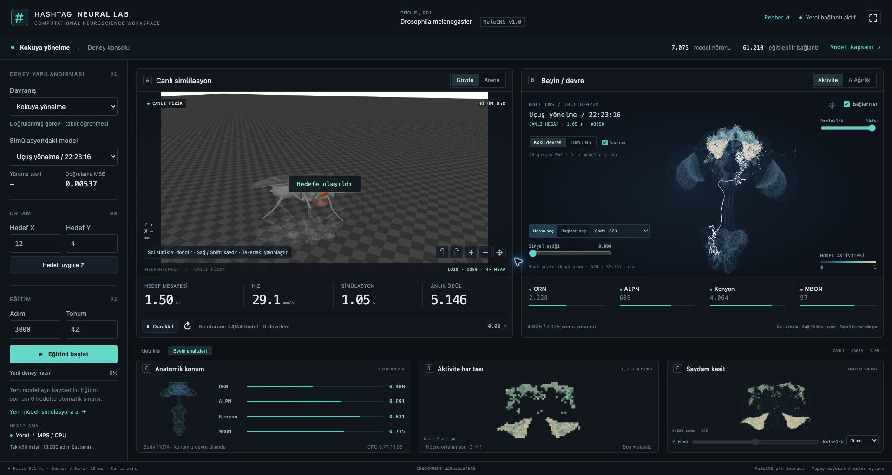
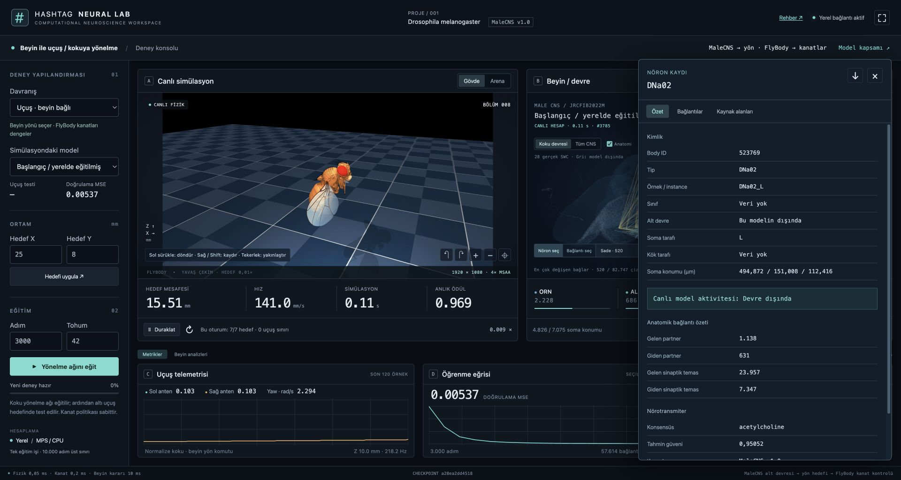

# Laboratuvar turu

**Bir ekranda deney, fizik ve kullanılan hesap.** `fruitfly ui` ile açılır;
sağ üstteki ⛶ tam ekranı etkinleştirir. Ana çalışma alanında sayfa kaydırması
olmaz; uzun nöron kayıtları kendi ayrıntı panelinde kayar. En az 1200×720
masaüstü alanı önerilir.

[Kurulum](docs/installation.md) · [Mouse ve metrikler](docs/usage.md) · [Eğitim](docs/training.md) · [Rehber dizini](docs/README.md)

## Ekranı soldan sağa okuyun

| Bölüm | Burada ne yaparsınız? |
| --- | --- |
| Deney konsolu | Davranış, kayıtlı model, hedef X/Y, eğitim adımı ve tohum seçimi |
| A — Canlı simülasyon | Gerçek MuJoCo görüntüsü, hedef mesafesi, hız, fizik zamanı, duraklatma |
| B — Beyin / devre | Aynı modelin son hesabı, nöron/bağ seçimi, aktivite ve Δ Ağırlık |
| Metrikler sekmesi | Anten sinyalleri, modelin öğrenme eğrisi, seçili kaydın özeti |
| Beyin analizleri sekmesi | Anatomik konum, X/Z aktivite haritası ve Y boyunca saydam kesit |
| Alt durum şeridi | Fizik/karar zamanlaması, checkpoint kimliği ve model kapsamı |

## Bir anı inceleyin

1. Hedefi uygulayın; sineğin yaklaşmasını izleyin.
2. **Duraklat** düğmesine basın. Fizik ve hesap sabitlenir, kameralar açık kalır.
3. Beyindeki bir noktayı veya dallanan iskeleti seçin.
4. Kaydın **Alt devre** alanına bakın. Model dışındaysa canlı aktivite yoktur.
5. **Bağlantılar** veya **Kaynak alanları** ile anatomik veriyi açın.

## Bağlantıları görünür tutun

**Sade · 520** okunabilir başlangıçtır. **Nöronun bağları** seçilen somanın bütün
giriş/çıkışlarını, **Tüm bağlar** konumlu 82.747 model bağlantısını açar.
Parlaklık renk vurgusunu değiştirir; sinyal eşiği küçük katkıları görünümden süzer.
İkisi de ağırlıkları veya fiziği değiştirmez. Çizgiler anatomik soma ilişkileridir.

**Aktivite** son ileri geçişin sürekli yanıtlarını gösterir. **Δ Ağırlık**,
kaydedilmiş modelin anatomik başlangıca göre bağlantı çarpanlarını gösterir;
yeni sinaps oluşumu veya iki ayrı eğitimin doğrudan farkı değildir.

## Alt analizler ne söyler?

Anatomik konum haritası gerçek CNS yüzeyini ve konumlu alt devrenin sınırını
gösterir. ORN/ALPN/Kenyon/MBON çubukları anatomik bölge sınırları değil, model
katmanlarının ortalama yanıtlarıdır. Aktivite haritasında boş hücre “veri yok”
demektir. Saydam kesit konum filtresidir; tıbbi X-ray veya ölçülmüş sıcaklık değildir.

Canlı görüntü 1920×1080 / 4× MSAA üretilir. Çözünürlük 60 FPS garantisi vermez;
RTF simülasyon zamanının duvar saatine oranıdır. Uçuş kanatları görmek için
yavaşlatılmıştır. [Uçuş ayrıntıları](flight/README.md).

## Deney değiştirirken

Devam eden eğitim ara ağırlıkları otomatik olarak canlıya uygulanmaz; simülasyon
seçili kaydı kullanır. Eğitim tamamlandığında yeni modeli siz yüklersiniz. UI'nin
“bu oturum” sayacı tekrar edilen canlı bölümlerdir; kaydedilmiş altı hedef test
skoruyla karıştırmayın. [Deneyleri doğru karşılaştırma](docs/experiments.md).
