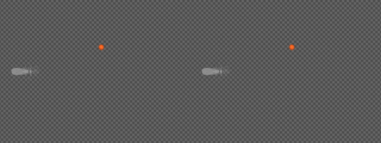

# Kokulu hedefe yürüyüş

**İki anten, bir yön kararı ve gerçek gövde fiziği.** MaleCNS kaynaklı alt devre
kokuya göre dönüşü seçer. FlyGym / NeuroMechFly hazır yürüyüş kontrolcüsü bacak
hareketini üretir; MuJoCo temasları ve gövde hareketini hesaplar.



*Sol eğitim öncesi, sağ 3.000 adım / tohum 42 sonrası. İki kayıt 5× yavaş;
sağ taraf başarıdan sonra son karede tutulur. [MP4](docs/media/walking-comparison.mp4).*

[Kurulum](docs/installation.md) · [Eğitim](docs/training.md) · [Kanıtlar](docs/experiments.md) · [Rehber dizini](docs/README.md)

## Kendiniz deneyin

```bash
fruitfly ui
```

1. **Kokuya yönelme** ve **Eğitim öncesi** modeli seçin.
2. **X=12, Y=4 mm → Hedefi uygula**. Yaklaşımı veya uzaklaşmayı izleyin.
3. Eğitilmiş kaydı seçip aynı hedefi tekrar uygulayın.
4. **Arena** ile yolu, **Gövde** ile bacakları inceleyin.
5. Yeni deney için **Adım=3000, Tohum=42 → Eğitimi başlat**.

Video canlı UI'nin yerine geçmez. Kayıt koşulları sabittir; UI'da hedefi,
modeli, kamerayı ve incelemek istediğiniz beyin görünümünü değiştirebilirsiniz.

## Döngü

```text
Gerçek anten konumları → sentetik sol/sağ koku yoğunluğu
→ yapay duyusal eşleme → 7.075 nöronluk MaleCNS alt ağı
→ yapay yön okuması → sol/sağ CPG genliği
→ FlyGym hibrit bacak kontrolcüsü → MuJoCo → yeni anten konumları
```

Karar aralığı 10 ms, fizik adımı 0,1 ms'dir. UI'da başarı **1,5 mm** hedef
mesafesidir; başarı veya 3 saniye sonunda aynı hedef/tohumla yeni bölüm başlar.
Bu tekrarlar ortamı gözlemek içindir, bağımsız bir başarı oranı tahmini değildir.

## Öğrenilen ve sabit kalan

İlk iki anatomik katman sabittir. **61.210 KC→MBON** bağlantısının pozitif,
sınırlı çarpanları ve yapay yön okuması 2.048 sentetik örnekte öğrenilir; 512 ayrı
örnek doğrulamada kullanılır. Bacak hareketi yeniden eğitilmez. Yeni anatomik
kenar eklenmez; koku molekülleri ve biyolojik reseptör kimlikleri modellenmez.

Bu sürümdeki eğitim gözetimli taklittir. Ekrandaki anlık ödül, optimizasyonun
ödül fonksiyonu değildir. Ayrı deneysel PPO denetimleri bu devrenin eğitildiği
veya biyolojik pekiştirmeli öğrenme yapıldığı şeklinde yorumlanmamalıdır.

## Gözlenen sonuçlar

14 Eylül 2026 tarihli medya kaydında hedef `(12, 4)` mm, fizik tohumu 10:
eğitim öncesi son mesafe **27,60 mm**, sonrası **1,50 mm**; iki durumda da
devrilme yok. Daha önceki altı koşullu testte sonuç **0/6 → 5/6** idi.
`(10, 5)` mm / tohum 12 başarısız koşul olarak korunmuştur.

Yeni video ile tarihsel çok koşullu değerlendirme ayrı kayıtlardır.
[Koşullar, model hash'leri ve ham ölçüm özeti](docs/experiments.md).

## Eski keşif sayfaları

Geliştirme ortamındaki `http://127.0.0.1:8765/simulation/` kayıtlı karşılaştırma
sayfasıdır; `8765/` anatomik keşif atlasıdır. Bunlar önceki yerel araştırma
çıktılarıdır. Yeni kullanıcıların bu porta ihtiyacı yoktur: **`fruitfly ui` 8766**
üzerinde canlı laboratuvarı ve **Rehber** bağlantısını sunar. Atlasın aynı 28
iskeleti canlı beyin görünümünde de kullanılır.

Kaynak: [NeuroMechFly / FlyGym](https://neuromechfly.org/) ·
[MaleCNS](https://male-cns.janelia.org/download/) · [Bilimsel sınırlar](docs/training.md#bilimsel-kapsam).
