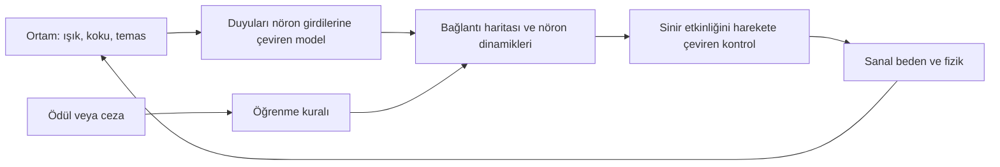

Sinek beynini bilgisayarda kullanmak — 13 Eylül 2026 araştırma notları

Mert'in `links.md` dosyasındaki kaynaklardan başlayarak hazırlanan teknik değerlendirme. Amaç, veriyi tanımak, 3B incelemek ve ileride simülasyon/öğrenme deneyleri kurmak. Bu çalışma sırasında veri indirildi ve doğrulandı; sinir ağı simülasyonu veya eğitim çalıştırılmadı.

Temel cevap: **3B inceleme yapılabilir. Gerçek bağlantılara dayanan çalışan bir model kurulabilir. Bu model sanal bir bedene bağlanabilir ve öğrenme kurallarıyla deney yapılabilir.** Bu aşamaların her biri farklı veri ve modelleme kararları gerektiriyor. Bağlantı haritası tek başına nöronların zaman içindeki davranışını belirlemiyor. Aynı bağlantılar, farklı hücre parametreleriyle farklı dinamikler üretebiliyor. [Beiran ve Litwin-Kumar, Nature Neuroscience 2025](https://www.nature.com/articles/s41593-025-02080-4)

Konuyu takip etmek için gereken birkaç kavram:

| Terim | Burada ne anlama geliyor? |
|---|---|
| Nöron | Diğer hücrelerden aldığı sinyallere göre davranan sinir hücresi. |
| Sinaps | Bir nöronun diğerine etki ettiği bağlantı noktası. İki hücre arasında çok sayıda olabilir. |
| Connectome / bağlantı haritası | Hangi hücrenin hangisine bağlandığının yapısal kaydı. |
| Spike | Bazı nöronların ürettiği kısa elektriksel olay; modeller bunu zaman damgalarıyla takip edebilir. |
| Nörotransmitter | Hücrelerin kimyasal iletişiminde kullanılan madde. Veri setindeki atamaların önemli bölümü tahmindir. |
| Plastisite | Deneyim veya etkinliğe göre bağlantı etkilerinin değişmesi; öğrenme modellerine ayrıca eklenir. |
| VNC | Beyinden gövdeye uzanan ventral sinir kordonu; omurilikle işlevsel benzerlik kurulabilir. |

Bu ayrımların deneysel/modelleme bağlamı: [Shiu ve arkadaşları, 2024](https://www.nature.com/articles/s41586-024-07763-9), [Hige ve arkadaşları, 2015](https://pmc.ncbi.nlm.nih.gov/articles/PMC4674068/).

Yeni yayımlanan çalışmanın adı **MaleCNS**. Resmî duyuru 3 Eylül 2026 tarihli; veri sürümü v1.0 ise 8 Haziran 2026'da yayımlanmış. Çalışma erkek sineğin merkezi beyni, görme lobları ve VNC'sini aynı örnekte birleştiriyor. Makale özetinde **166.691 nöron ve 11.691 hücre tipi**, Google duyurusunda yaklaşık **125 milyon sinaptik bağlantı** bildiriliyor. Yeniliğin önemli kısmı, boyun bağlantısını koruyan bütün merkezi sinir sistemi ve dişi örneklerle karşılaştırma olanağı. [Janelia proje sayfası](https://www.janelia.org/project-team/flyem/male-cns-connectome), [Google duyurusu](https://research.google/blog/a-connectomics-milestone-mapping-the-complete-male-fruit-fly-brain/), [makale özeti](https://research.google/pubs/sexual-dimorphism-in-the-complete-connectome-of-the-drosophila-male-central-nervous-system/), [sürüm notları](https://male-cns.janelia.org/release/)

| Kaynak/veri seti | Kapsam | Bizim için anlamı |
|---|---|---|
| MaleCNS v1.0 | Erkek sineğin beyni ve VNC'si | Yeni veriyi keşfetmek ve beyin–gövde devrelerini incelemek için başlangıç. |
| FlyWire FAFB | Yetişkin dişi sineğin beyni; 2024 makalesinde 139.255 nöron | Çağatay'ın deneyleri ve birçok hesaplamalı model bu aileyi kullanıyor. |
| FlyWire snapshot 783 | FlyWire'ın belirli bir veri anlık görüntüsü | Çağatay'ın notlarındaki sürüm; başka sürümlerin hücre kimlikleriyle gelişigüzel karıştırılmamalı. |
| BANC | Dişi sinekte beyin ve sinir kordonunu birleştiren ayrı örnek | MaleCNS ile karşılaştırılabilecek başka bir bütün CNS kaynağı. |

FlyWire için [2024 ana makalesi](https://www.nature.com/articles/s41586-024-07558-y); BANC için [2026 makalesi](https://www.nature.com/articles/s41586-026-10735-w). Farklı örnekler arasında geometrik hizalama, hücrelerin biyolojik olarak birebir aynı olduğu anlamına gelmez.

Bilgisayara indirdiğim paket [data/male-cns-v1.0](data/male-cns-v1.0/) altında. Kaynak dosyalar değiştirilmedi. GCS nesne sürümlerini `generation` ile sabitledim; her dosya için sunucunun CRC32C değerini doğruladım ve yerel SHA-256 kaydettim. Toplam **1.110.163.400 bayt**, yaklaşık **1,11 GB / 1,03 GiB**.

| Yerel dosya | Boyut, ondalık MB | İçerik |
|---|---:|---|
| `body-annotations-male-cns-v1.0-minconf-0.5.feather` | 14,48 | Hücre/segment kimlikleri, tipler, sınıflar ve açıklamalar. |
| `body-neurotransmitters-male-cns-v1.0.feather` | 43,28 | Kimyasal iletici tahminleri, güven değerleri ve uzlaşma alanları. |
| `connectome-weights-male-cns-v1.0-minconf-0.5.feather` | 1.051,24 | Yayımlanan tam segmentler arası bağlantı tablosu. |
| `12781.swc` | 0,55 | DNge104_R örnek nöron iskeleti. |
| `556329.swc` | 0,60 | DNge104_L örnek nöron iskeleti. |

Resmî dağıtım, veri biçimleri ve CC-BY atfı: [MaleCNS indirme sayfası](https://male-cns.janelia.org/download/). Tam mikroskopi hacimleri, tüm nöronların 3B yüzeyleri, tek tek sinaps koordinatları ve yerel neuPrint veritabanı bu pakete dahil değil. Örnek SWC koordinatlarında bir birim 8 nm; mikrometreye dönüşüm katsayısı 0,008.

Doğrulama sonuçları [validation.json](data/male-cns-v1.0/validation.json), kaynak adresleri ve hash'ler [manifest.json](data/male-cns-v1.0/manifest.json) içinde. Feather dosyalarını gerçekten açtım; anahtar benzersizliğini, bağlantılardaki boş alanları ve pozitif ağırlıkları kontrol ettim. İki SWC'deki düğüm kimlikleri, koordinatlar ve ebeveyn referansları da temel yapısal kontrollerden geçti.

Yerel ölçümde ham bağlantı dosyası **151.856.684 satır** içeriyor. Bu satır sayısını nöron veya sinaps sayısı diye kullanmamak gerekiyor: dosya, sınıflandırılmış nöronların dışındaki segmentleri de kapsıyor. Açıklama tablosunda `superclass` boş olmayan kayıtları seçip iki ucu da bu kümede bulunan bağlantıları sayınca:

| Yerel keşif filtresinin çıktısı | Sayı |
|---|---:|
| Sınıf etiketi bulunan kayıt | 166.700 |
| Bu kayıtlar arasındaki yönlü bağlantı | 25.582.938 |
| Bağlantı ağırlıkları toplamı, sinaptik temas | 124.177.617 |

Bu **benim açıkça tanımladığım keşif filtrem**; makaledeki 166.691 nöronluk seçimin yeniden üretimi değil. Dokuz kaydın farkını araştırmadan aynı sayım gibi sunmamalıyız. Filtre sonucu ayrı bir model veya eğitilmiş ağırlık dosyası olarak kaydedilmedi; asıl kaynak dosyalar korunuyor.

Gönderdiğin bağlantıların görevleri şöyle:

| Kaynak | Sağladığı şey ve kullanım yeri |
|---|---|
| [Google Neural Mapping](https://sites.research.google/gr/neural-mapping/) | Alanın genel çerçevesi, projeler ve birincil yayınlara geçiş. |
| [Janelia MaleCNS](https://www.janelia.org/project-team/flyem/male-cns-connectome) | Veri kapsamı, yayınlar ve resmî erişim araçları. |
| [MaleCNS download](https://male-cns.janelia.org/download/) | Hesapsız toplu dosya indirme; neuPrint API için hesap/token açıklaması. |
| [NeuronBridge](https://neuronbridge.janelia.org/) | Nöron biçimlerini ışık ve elektron mikroskopisi kaynakları arasında eşleştirme. Arayüzünü açıp doğruladım. |
| [Virtual Fly Brain](https://www.virtualflybrain.org/) | Anatomi, hücre isimleri, görüntüler ve bağlantılar için birleşik atlas. |
| [Gönderdiğin VFB görünümü](https://v2.virtualflybrain.org/org.geppetto.frontend/geppetto?id=FBbt_00040043&i=VFB_00101567,VFB_00102282) | Belirli bölge ve görüntü katmanlarına açılan bağlantı; dilim ve 3B atlas görüntüsünü tarayıcıda gördüm. |
| [FlyLight](https://www.janelia.org/project-team/flylight) | Hücreleri biyolojik deneylerde seçerek görüntülemek/manipüle etmek için genetik araçlar ve görüntüler. |
| [FlyLight raw](https://flylight-raw.janelia.org/cgi-bin/raw.cgi) | Geniş ham görüntü koleksiyonu. Sayfa, diğer küratörlü FlyLight koleksiyonlarıyla aynı doğrulama düzeyinde olmadığını belirtiyor. |
| [neuprint-python](https://github.com/connectome-neuprint/neuprint-python) | Sunucudan hücre, bağlantı ve ilgili veri sorgulama. |
| [NAVis dokümantasyonu](https://navis-org.github.io/navis/stable/) | Python'da nöron biçimi analizi, SWC/mesh okuma, 2B/3B çizim ve dönüşümler. |
| [NAVis örnekleri](https://navis-org.github.io/navis/generated/gallery/) | Veri yükleme, çizim, şekil karşılaştırma ve dış araçlarla çalışma örnekleri. |
| [navis-flybrains](https://github.com/navis-org/navis-flybrains) | Beyin şablonları ve koordinat sistemleri arasında dönüşüm; çalıştırılabilir beyin modeli sağlamıyor. |
| [Çağatay'ın deney günlüğü](https://cagataycali.github.io/fruitfly-brain/) | FlyWire tabanlı kişisel hesaplama deneyleri; modelleme ve deney tasarımı için değerli bir kaynak. |

3B keşifte iki yol var. **Çevrimiçi atlas**, tüm hacmi indirmeden seçilen bölgeyi görüntüler. MaleCNS'in [resmî Neuroglancer sahnesi](https://neuroglancer-demo.appspot.com/#!gs://flyem-male-cns/v1.0/male-cns-v1.0.json) beyin/VNC, nöron segmentleri ve ilgili katmanlara erişim sağlar. **Yerel incelemede** SWC, hücrenin dallanan merkez çizgisini; mesh ise yüzeyini temsil eder. Bağlantı tablosu bu geometrinin yerini tutmaz. NAVis, yerel SWC ve mesh'leri okuyup 3B çizebilir. İlk yerel örnek için indirdiğim iki DNge104 hücresi yeterli; tüm sinir sisteminin çevrimdışı anatomik görüntüsü ayrıca hazırlanmalı. [NAVis](https://navis-org.github.io/navis/stable/)

Çağatay'ın sayfasında prolog ve 61 bölümü taradım; özellikle öğrenme, geri çekilen sonuçlar ve son sentezleri yakından inceledim. Çalışma FlyWire snapshot 783 kullanıyor. Bölüm 19'daki öğrenme iddiası, 21'de farklı rastgele tohumlarla tekrarlanınca geri çekilmiş. Bölüm 23'te idealize edilmiş dendrit/tesadüf algılama mekanizmasıyla ayrım sağlanıyor; 25'te unutma ayrıca ekleniyor. Bölüm 26'nın doğrulaması aynı hesaplamalı model içinde; canlı sinek deneyi değil. Bölüm 34 ve 53 bağlantıların uyarıcı/baskılayıcı işaretlerindeki sorunları tartışıyor. 53, öğrenme deneylerini yeniden çalıştırma ihtiyacını belirtiyor; sonraki 54–61 bölümlerinde bu öğrenme serisinin tam tekrarını göremedim. Dolayısıyla o sonuçları yeniden üretmeden temel kabul etmem. Son bölüm de modelin bedene bağlı olmadığını açıkça söylüyor. Deneyleri burada çalıştırmadım; değerlendirme yayımlanan metne dayanıyor. [Deney günlüğü](https://cagataycali.github.io/fruitfly-brain/)

Çalışan beyin modeli açısından güçlü başlangıçlardan biri **Shiu ve arkadaşlarının 2024 çalışması**. FlyWire bağlantıları üzerine basit LIF nöronları yerleştiriyor; tat ve anten temizleme devrelerinden bazı tahminleri canlı sinek deneyleriyle sınanmış. LIF, hücreyi zamanla sönümlenen ve eşik aşınca sinyal üreten bir birim olarak modeller. Bu yaklaşımda hücre biçimleri, reseptör ayrıntıları, elektriksel bağlantılar ve nöromodülasyon gibi unsurlar eksik. Yazarlar mutlak ateşleme hızlarının doğruluğunu özellikle sınırlıyor. Genel öğrenme veya bütün hayvanın davranışı doğrulanmış değil. [Makale](https://www.nature.com/articles/s41586-024-07763-9), [resmî kod](https://github.com/philshiu/Drosophila_brain_model)

İkinci yol, bağlantı yapısını koruyup eksik hücre/sinaps parametrelerini bir görevden öğrenmek. **FlyVis** çalışması, sineğin görsel hareket devrelerindeki bağlantıları kullanıp görev eğitimiyle nöron tepkileri hakkında deneylerle karşılaştırılabilir tahminler üretiyor. Bu yaklaşım, biyolojiden gelen yapı ile ayrıca öğrenilen parametreleri ayırmak için iyi bir örnek. [Lappalainen ve arkadaşları, Nature 2024](https://www.nature.com/articles/s41586-024-07939-3)

Simülasyondaki sinek fikri için sıfırdan beden yazmamız gerekmiyor:

| Kaynak | Ne sağlıyor? | Sınır |
|---|---|---|
| [NeuroMechFly v2 / FlyGym](https://neuromechfly.org/) | Görme, koku, temas ve hareket etkileşimleri için MuJoCo tabanlı sanal sinek ortamı. | Tam MaleCNS beynini otomatik yükleyen paket değil. |
| [flybody](https://github.com/TuragaLab/flybody) | Ayrıntılı beden modeli, yürüme/uçuş görevleri ve öğrenilmiş hareket kontrolü için altyapı. | Bedenin gerçekçi hareketi, kontrol eden ağın biyolojik doğruluğunu tek başına göstermez. |
| [FlyGM](https://arxiv.org/abs/2602.17997) | Bağlantı grafiği yapısındaki bir kontrolcüyü derin pekiştirmeli öğrenmeyle sanal sinek hareketlerine uyarlayan çalışma. | İncelediğim arXiv v3 bir ön baskı; doğrudan yeni MaleCNS verisinin hazır emülasyonu olarak alınmamalı. |

NeuroMechFly'nin [2024 makalesi](https://www.nature.com/articles/s41592-024-02497-y) ve flybody'nin [2025 makalesi](https://www.nature.com/articles/s41586-025-09029-4) beden, duyular ve kontrol katmanlarını ayrıntılandırıyor. flybody'nin temel kurulumu ile eğitim/policy bağımlılıkları ayrı; Mac'te temel simülasyon ve kapsamlı eğitim hattı için aynı uyumluluk varsayımını yapmamalıyız.

Olası düzenimiz şu olur:

Bu şema bir tasarım önerisi. Haritadan aldığımız yapı ile bizim tanımladığımız duyusal kodlama, hücre davranışı, hareket eşlemesi ve öğrenme kuralını ayrı tutacağız. Örneğin bir nöronun etkinliğini “sola dön” komutuna bağlarsak, bunun gerçek sinekte aynı işlevi taşıyıp taşımadığını ayrıca belirtmeliyiz.

Bu ayrım yalnız teorik değil: **Digital Sphinx** ön baskısında solucan bağlantı ağı, öğrenilmiş arayüzlerle sinek bedenini yürütmek için kullanılıyor. Çalışmanın amacı, başarılı görünen hareketin tek başına doğru beyin emülasyonu kanıtı olmadığını göstermek. Bizim ölçütümüz hem dış davranış hem de hangi model bileşeninin bu davranışı ürettiği olmalı. [Brunton ve arkadaşları, 2026](https://www.biorxiv.org/content/10.64898/2026.03.20.713233v1), [araştırmacıların kodu](https://github.com/Brunton-Lab/DigitalSphinx2026)

Yeni bulduğum iki güncel oyun denemesi de öğretici. **DOOMFLY**, MaleCNS'i Doom girdileri ve oyun komutlarıyla bağlıyor; kendi README'sinde mevcut v6 adayının görsel, koşullanma ve hayatta kalma doğrulamalarından geçemediğini söylüyor. **Fly64**, bağlantılardan Mario komutları çıkarıyor; README açıkça eğitim, ödül ve yıldız toplama hedefi olmadığını belirtiyor. Bunlar kullanılabilir deney örnekleri; “beyin oyunu öğrendi” sonucunu desteklemiyorlar. Bu durumlar 13 Eylül 2026'da kontrol edildi. [DOOMFLY](https://github.com/nftechie/doomfly), [Fly64](https://github.com/ornata/fly)

Öğretme fikrinde en anlaşılır ilk hedef, **iki kokuyu ayırt eden basit bir ilişkilendirme deneyi** olur: A kokusu bir ceza sinyaliyle eşleşir, B eşleşmez; sonra ceza olmadan iki kokuya verilen tepki karşılaştırılır. Sineğin mushroom body devrelerinde koku ve belirli dopamin hücrelerinin birlikte etkinleşmesiyle kokuya özgü sinaptik değişim gösterilmiş. Bu biyolojik bulgu model kurmamıza dayanak sağlar; tüm dopamin etkilerini tek bir evrensel ödül sayısına indirgememeliyiz. [Hige ve arkadaşları](https://pmc.ncbi.nlm.nih.gov/articles/PMC4674068/)

Benim önerdiğim deney sırası:

1. **Anatomiyi tanıyalım.** Birkaç hücreyi ve beyin bölgesini 3B açalım; aynı hücrenin bağlantı listesini yanında görelim. Kabul ölçütü: görünen nesne, açıklama ve bağlantı kimlikleri uyuşuyor.
2. **Etkinlik üretelim.** Tanımlı bir duyu hücresi grubunu uyarıp hangi hücrelerin ne zaman tepki verdiğini ölçelim. Önce yayımlanmış bir örneği kendi veri sürümüyle tekrar etmek, MaleCNS uyarlamasından daha kolay karşılaştırılır.
3. **Devreyi değiştirelim.** Belirli hücreleri susturup sağlam ağla karşılaştıralım. Tek rastgele tohum yerine tekrarlar; aynı büyüklükte rastgele hücre susturma kontrolü kullanalım.
4. **Öğrenmeyi sınayalım.** İki koku deneyinde eğitim öncesi/sonrası farkı, eğitimde kullanılmayan girdilerle ölçelim. Plastisite kapalı ve ödül eşleşmesi karıştırılmış kontroller olmadan öğrenme iddiası kurmayalım.
5. **Basit sanal ortama bağlayalım.** İlk beden, kokular arasında seçim yapan basit bir 2B varlık olabilir. Daha sonra ayrıntılı FlyGym/flybody bedeni eklenebilir.

Bu sırada yapabileceğimiz başka oyunlar: iki beyin bölgesi arasındaki yolları bulmak, belirli bağlantıları azaltınca tepki değişimini izlemek, görsel hareket yönlerini karşılaştırmak ve öğrenilen tepkinin zamanla unutulmasını denemek. Bunlar önerilen deneyler; henüz uygulanmış sonuçlar değil.

Makinede doğrudan kontrol ettiğim donanım **Apple M4 Max ve 128 GiB bellek**; başlangıçta yaklaşık 398 GB boş alan vardı. Veri okuma ve analiz kontrolleri bu makinede başarıyla tamamlandı. Bu sonuç, tam ağın gerçek zamanda simülasyonu veya eğitim hızı için benchmark değil. İlk modelde seyrek bağlantı gösterimi kullanmak önemli: 166.700 × 166.700 boyutlu tek bir yoğun float32 matris yaklaşık 111 GB tutar; ara hesaplar buna eklenir. Mevcut kenarları saklayan seyrek gösterim çok daha uygun. Bu bellek hesabı teorik hesap; simülasyon performansı ayrıca ölçülecek.

İleride uygulamaya geçerken kritik teknik noktalar: veri sürümü ve seçilen hücre kümesini kaydetmek; hücre kimliklerini tamsayı/metin olarak korumak; SWC ve diğer koordinatların birimlerini karıştırmamak; sinaps sayısını doğrudan fizyolojik ağırlık kabul ederken varsayımı belirtmek; nörotransmitter tahmini ile uyarıcı/baskılayıcı etkiyi eşitlememek; her denemede değişen parametreleri ve rastgele tohumları kaydetmek. Bunlar ilk araştırmadan çıkan uygulama kararlarıdır.

Kaynak erişiminin sınırları: `links.md` içindeki tüm adresler içerik veya arayüz üzerinden incelendi. Çağatay'ın uzun sayfası HTTP üzerinden alındı; tam deney kodu ve her deney sonucu bağımsız olarak yeniden üretilmedi. VFB'nin 3B ve dilim görüntüsü tarayıcıda doğrulandı; bu, tüm MaleCNS geometrisinin yerel ve çevrimdışı hazır olduğu anlamına gelmiyor. Ek kaynaklardan Cell ana makalesi ve MaleCNS bioRxiv sürümü tam metin erişiminde 403 verdi; MaleCNS kapsamı ve yayın bilgisi için resmî Janelia/Google açıklamaları ile yayın özeti kullanıldı. Diğer simülasyon projeleri kurulup çalıştırılmadı.
