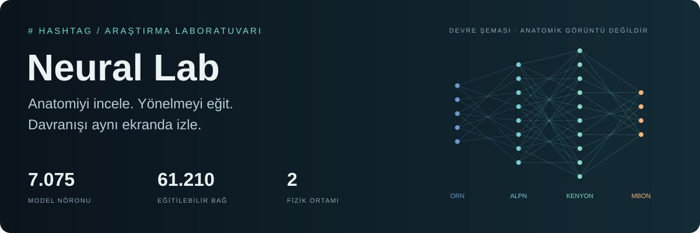

# Neural Lab rehber dizini



**Kur, incele, eğit, karşılaştır.** Bu dizin bilgisayarında Neural Lab kullanmak
isteyen, yazılıma aşina ama hesaplamalı sinirbilime yeni başlayan kullanıcılar içindir.
Kod adları ve kaynak veri alanları özgün halleriyle korunur; açıklamalar Türkçedir.

## İlk kez geliyorsanız

1. [Kurulum](installation.md): pipx uygulamasını açın; veri ve bilimsel ortamı hazırlayın.
2. [UI kullanımı](usage.md): hedef, mouse, model seçimi ve canlı metrikleri öğrenin.
3. [Eğitim](training.md): 3.000 adım / tohum 42 deneyini çalıştırın, yeni kaydı karşılaştırın.
4. [Deney kayıtları](experiments.md): kendi sonucunuzu hangi koşullarla karşılaştıracağınızı görün.

## İhtiyacınıza göre

| Amaç | Başlangıç |
| --- | --- |
| Projenin hikâyesi ve canlı görüntüler | [Ana README](../README.md) |
| Tek ekranın çalışma mantığı | [Laboratuvar turu](../LAB.md) |
| Eğitim öncesi/sonrası yürüyüş | [Simülasyon rehberi](../SIMULATION.md) |
| Beyne bağlı uçuş, zamanlama, motor adaptörü | [Uçuş README](../flight/README.md) |
| Hangi veriyi, kaç GB ve neden indiriyorum? | [Veriler ve modeller](data.md) |
| Hata, port, güncelleme, yedekleme, kaldırma | [Sorun giderme](troubleshooting.md) |
| Kodu değiştir, doğrula, paketle | [Geliştirme](development.md) |
| Görüntülerin kaynağı ve kayıt koşulları | [Medya README](media/README.md) |
| Araştırma kaynakları ve lisanslar | [Üçüncü taraf bildirimleri](../THIRD_PARTY_NOTICES.md) |

## İnternetsiz rehber

```bash
fruitfly docs
```

UI'daki **Rehber** bağlantısı da aynı yerel belgeyi açar. Metinler, ekran
görüntüleri, şemalar ve kısa videolar pakete dahildir. Resmi araştırma siteleri,
GitHub, PyPI ve dış kaynak bağlantıları internet gerektirir. Çevrimdışı HTML
[buradadır](index.html); düzenleme kaynağı Markdown dosyalarıdır.

[← Projeye dön](../README.md)
