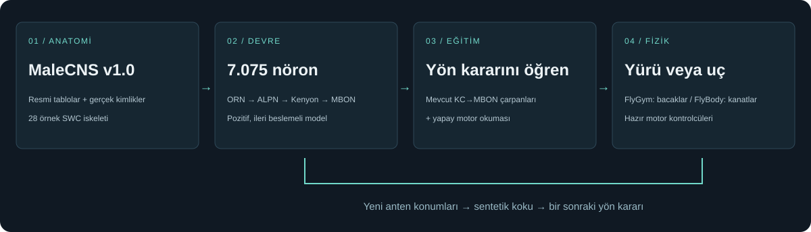

# Geliştirme ve yayın



[Rehber dizini](README.md) · [Kurulum](installation.md) · [Kullanım](usage.md) · [Eğitim](training.md)

## Mimari

`src/fruitfly_lab/` hafif CLI ve kurulum ekranıdır; yalnızca `uv` bağımlılığı vardır.
Kök Python dosyaları, mevcut FastAPI + MuJoCo uygulamasıdır. `ui/` vendored Three.js
kullanan statik arayüzdür; Node build adımı gerekmez. `environments/walking/` Python
3.12 bilimsel ortamının ayrı `pyproject.toml` ve `uv.lock` dosyalarını tutar.
`flight/` Python 3.11 ortamıdır; TensorFlow/NumPy uyumluluğu için ayrıdır.

Wheel, bu kaynak dosyalarının **açık izin listesini** `fruitfly_lab/bundle/` içine
yerleştirir. CLI kodu kullanıcı çalışma dizinine kopyalar; bilimsel ortam o dizinde
oluşturulur. Bu yüzden site-packages içine veri/model yazılmaz. Her dosyanın özeti
`.fruitfly-bundle.json` ile izlenir; yerel kod değişiklikleri sessizce ezilmez.

Kurulum ekranı standart Python HTTP sunucusudur; host/origin kontrolü ve tek iş
sınırı vardır. Başlatma düğmesi aynı portu bilimsel FastAPI sunucusuna devreder.
Kurulum 2 saatle, tek alt komut 1 saatle sınırlanır; durdurma alt süreç grubunu
kapatır. Veri ve model işlemleri yereldir. Cloud/LLM/MCP servisi gerekmez.

## Yerel geliştirme

```bash
export UV_PROJECT_ENVIRONMENT=.runtime/dev-venv
uv sync --locked --group dev
uv run --no-sync python -m unittest discover -s tests -v
uv run --no-sync python tools/build_docs.py --check
uv build
uv run --no-sync python -m twine check dist/*
```

Kök ortam artık hafif uygulama içindir. Bilimsel bağımlılık için **kaynak repoda
eski doğrudan `uv sync` alışkanlığını kullanmayın**; `fruitfly setup walking` ayrı
çalışma dizinini hazırlar. Paket dışı bilimsel geliştirme gerekiyorsa ortam
manifestini inceleyip izole test dizini kullanın. `ui.sh` eski yerel geliştirici
ortamını açan yardımcıdır; son kullanıcı akışı `fruitfly ui` komutudur.

Doküman Markdown'ını değiştirdikten sonra `uv run python tools/build_docs.py`
çalıştırın. Bu komut PyPI için sürüm etiketine bağlı mutlak görsel bağlantıları
içeren `docs/PYPI.md` dosyasını da üretir; onu elle düzenlemeyin. `docs/index.html` çevrimdışı tek sayfa rehberidir; README ve bütün rehber
bölümlerinden üretilir. Görsel bağlantıları yerel dosyalara, bölüm bağlantıları
benzersiz sayfa çapalarına çevrilir; çevrimdışı sürüm dış rozetleri yüklemez. CI eski kalan HTML'i yakalar.

## Paket doğrulaması

```bash
pipx install ./dist/fruitfly_hashtag-0.2.1-py3-none-any.whl
fruitfly --home /tmp/neural-lab-clean ui --port 8770 --no-browser
```

Boş dizinde `/` kurulum ekranını, `/guide/index.html` kılavuzu, `/api/setup`
hazır olmayan durumu döndürmelidir. Beyin verisi kendiliğinden indirilmemelidir.
Test paketi wheel/sdist'te `data/`, `models/`, `.venv/`, `.runtime/`, anahtar veya
kişisel eğitim bulunmadığını kontrol eder. Ağ indirmeleri ve bilimsel simülasyon
birim testlerinde çalıştırılmaz; ayrıca temiz bilimsel kurulum kontrolü gerekir.

## GitHub / PyPI

GitHub deposu: https://github.com/mertozbas/fruitfly-hashtag
PyPI adı: `fruitfly-hashtag`. Paket build'i PyPI yayını anlamına gelmez.

1. Sürümü `pyproject.toml` ve `src/fruitfly_lab/__init__.py` içinde artırın.
2. Rehberi üretin, test/build/metadata kontrolünü çalıştırın. Arşiv listesini inceleyin.
3. Kaynak değişikliklerini main'e pushlayın; CI sonucunu bekleyin.
4. `v0.2.1` gibi etiket ve GitHub release oluşturun; doğrulanmış wheel/sdist ekleyin.
5. PyPI için aşağıdaki iki yöntemden birini kullanın; kimlik bilgilerini repoya koymayın.

**Trusted Publishing:** PyPI hesabında pending publisher oluşturup owner
`mertozbas`, repo `fruitfly-hashtag`, workflow `publish.yml`, environment `pypi`
tanımlayın. Sonra GitHub Actions'tan yayın işini elle başlatın. Bu işlem otomatik
etiket push'unda yayın yapmaz. [PyPI resmi rehber](https://docs.pypi.org/trusted-publishers/).

**Yerel token:** Ortamda yetkili `TWINE_USERNAME=__token__` ve `TWINE_PASSWORD`
güvenle tanımlıysa `uv run python -m twine upload dist/*` kullanılır. Token'ı
komut satırına, günlük dosyasına veya README'ye yazmayın.

Yayın sonrası `pipx install fruitfly-hashtag==0.2.1` ile **gerçek PyPI kaynağından**
yeni izole kurulum doğrulanmalıdır. Kaynak kod, paket meta verisi ve PyPI hash'leri
uyumlu olmalıdır. PyPI sürümü değiştirilemez; hata düzeltmesi yeni sürüm gerektirir.

<a id="medya-uretimi"></a>
## Gerçek simülasyondan medya üretimi

Kaynak reponun kökünde çalışın. FFmpeg kurulu olmalı (`brew install ffmpeg`).
Önce `fruitfly setup walking` ve uçuş için `fruitfly setup flight` tamamlanmış olmalı.
Aşağıdaki `LAB_DIR` kendi çalışma dizininizdir; araç yalnızca model okur, eğitim
kaydı yazmaz. Her çalıştırmada seçilen çıktı dizinindeki aynı adlı medya yenilenir.

```bash
LAB_DIR="$HOME/.fruitfly-hashtag"
"$LAB_DIR/.venv/bin/python" tools/record_media.py walking \
  --home "$LAB_DIR" --output /tmp/neural-lab-media
"$LAB_DIR/flight/.venv/bin/python" tools/record_media.py flight \
  --home "$LAB_DIR" --output /tmp/neural-lab-media
```

Yürüyüş iki model × iki kamera MP4'ü ve `walking-recording.json` üretir.
Uçuş `flight.mp4` ve `flight-recording.json` üretir. JSON fizik sonuçlarını,
model SHA256'sını, hedefi, tohumu ve oynatım hızını kaydeder.

Yan yana yürüyüş kaydı; sağdaki başarılı kayıt sonlandıktan sonra son kare tutulur:

```bash
ffmpeg -y -i /tmp/neural-lab-media/walking-untrained-arena.mp4 \
  -i /tmp/neural-lab-media/walking-trained-arena.mp4 \
  -filter_complex '[0:v]scale=384:288,setsar=1[a];[1:v]scale=384:288,setsar=1,tpad=stop_mode=clone:stop_duration=15[b];[a][b]hstack=shortest=1[v]' \
  -map '[v]' -an -c:v libx264 -crf 23 -pix_fmt yuv420p -movflags +faststart \
  /tmp/neural-lab-media/walking-comparison.mp4
```

`-y` yalnızca belirtilen çıktı dosyasını yeniler. Videoyu yayımlarken sonuç JSON'unu
kontrol edin; “sağ taraf başarılı” açıklaması her yeni eğitimde otomatik doğru
olmaz. UI ekranlarını gerçek tarayıcı sekmesinden alın; demo sayacı veya MSE'yi
sonradan değiştirmeyin. Medya kökenini ve dosya SHA256'larını `docs/media/` altında
belgeleyin. `pyproject.toml` içindeki wheel/sdist izin listesine her yeni varlığı
ayrı ekleyin. Paket bütçesi 10 MB, tek dosya sınırı 4 MB'dir; ham model ve veri
uzantıları yasak kalır. Uzun kayıtları pakete koymayın.
