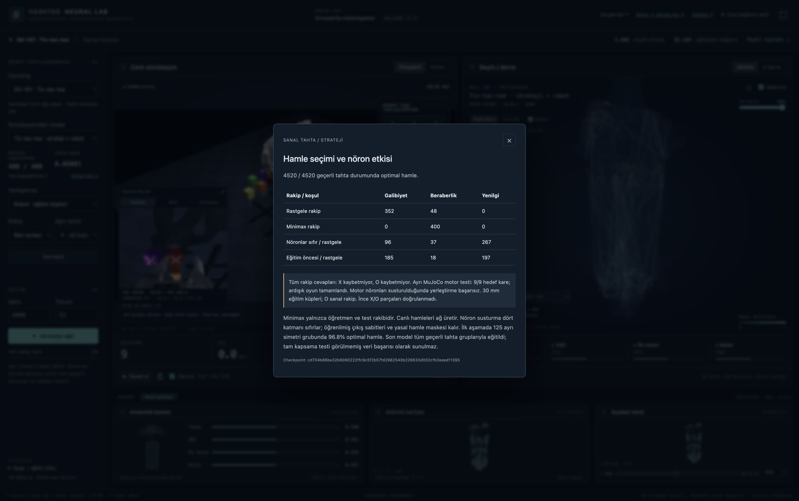
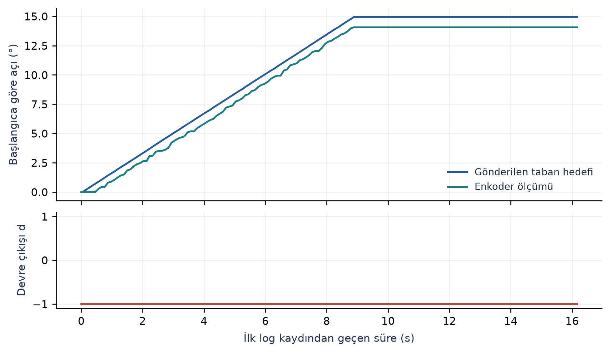

# Research evidence

This public snapshot documents connectome-derived SO-101 simulation, tic-tac-toe strategy and manipulation, and a separate bounded physical-motion experiment.

Read the [technical research note](research-note.md) for methods, results, limitations and planned work. It is a retrospective project report, not a peer-reviewed paper.

| Evidence level | Recorded observation |
| --- | --- |
| Learned XOX strategy | 4,520 / 4,520 optimal decisions across the complete finite decision set |
| SO-101 XOX in MuJoCo | 9 / 9 destinations; 5 / 5 sequential X placements in one game |
| SO-101 cube placement in MuJoCo | 94 / 100 held-out state-input trials |
| Physical SO-101 | Real base motion; R1: 160 encoder counts, approximately 14.07° |

XOX strategy and simulation use a 3,488-neuron anatomical subgraph. Physical motion used a separate 4,387-neuron visual subgraph. The final XOX strategy trained on the full finite canonical board set. Physical XOX and autonomous physical grasping have not been demonstrated.



*A UI view of recorded strategy and simulation results. Screenshot capture is separate from the original benchmark execution.*



*Historical physical experiment, 16 September 2026. Neural drive remains saturated in one direction; this trace does not establish bidirectional visual tracking.*

The [machine-readable summary](results.json), [episode outcomes](so101-episodes.csv), [motor trials](tictactoe-motor.csv), [physical segments](physical-runs.csv) and [physical trace](physical-motion.csv) include unsuccessful outcomes. The [provenance manifest](provenance.json) records source identities and public file hashes. Private raw sessions and device metadata are excluded.

The [26 September validation record](validation-2026-09-26.json) reports **247 distinct passing software tests** and a fresh XOX strategy evaluation matching the historical result. Full motor benchmarks and physical experiments were not rerun.

Verify the compact evidence without scientific dependencies or hardware:

```bash
python3 docs/research/verify_evidence.py
```

The verifier recalculates counts and displacements from the public CSVs. It does not run new experiments. The optional [export utility](export_evidence.py) requires the original unpublished local records; [reproduction boundaries](research-note.md#evidence-and-reproducibility) explain what is included.

**Coming soon:** research into an LLM-like interaction interface around a connectome-derived model. No language-model capability is claimed by this snapshot.
