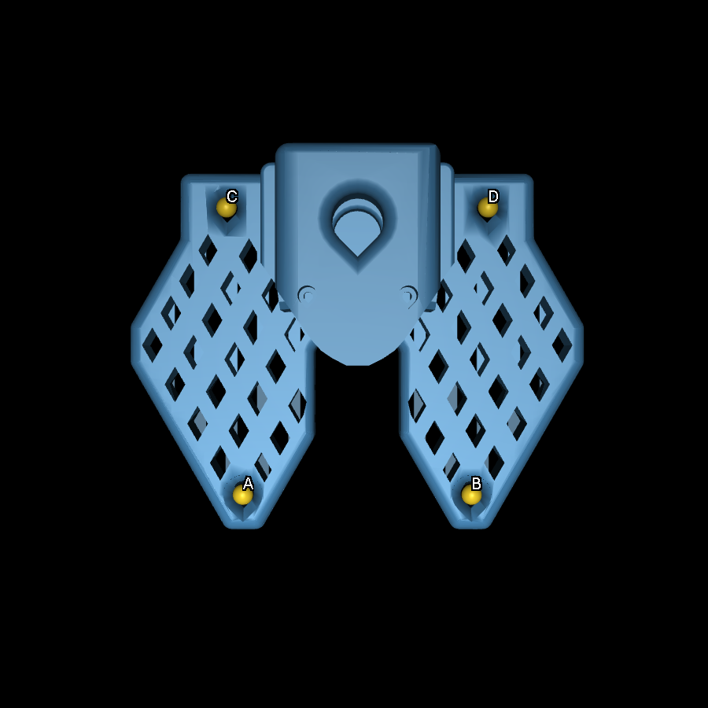

# Gerçek SO-101: bağlantı ve devreye alma

Neural Lab'ın **Gerçek kol ↗** paneli fiziksel SO-101 follower'ı ve USB kameralarını
tanılamaya hazırlar. Motor konumlarını, sıcaklığı, voltajı ve mevcut tork durumunu
okur; kaydedilmiş kalibrasyonu motor belleğiyle karşılaştırır. Bilek ve sabit kamera
için ayrı gerçek RGB önizlemeleri sunar.

**Bağlantı tanılaması salt okunurdur; Kol kalibrasyonu ayrı bir yazma akışıdır.**
Sihirbaz, kol desteklenirken verdiğiniz onayla torku kapatır ve kalibrasyon
ayarlarını yazar. Hedef konumu göndermez, torku açmaz.
Simülasyondaki al ve yerleştir / tic-tac-toe modelleri henüz fiziksel kolda
devreye alınmadı. Donanım panelini açmak, ana ekrandaki beyni gerçek kola bağlamaz;
ana ekran simülasyonun sinir ağı hesabını göstermeye devam eder.

**Sınırlı fiziksel beyin deneyi:** `held_neural_wrist_v1`, aşağıda açıklanan
tek bilek darbesinde yerel görsel devrenin çıkışını gerçek motora bağlayabilir.
Bu mühendislik deneyi ana ekrandaki simülasyon akışını değiştirmez.

### Yerel fiziksel devreye alma araçları

`so101.alignment_probe` ve `so101.pose_hold`, denetimli mühendislik ölçümleri için
eklenmiştir; genel hareket API'si veya otonom görev yürütücüsü değildir. Plan,
güncel eklem konumları, USB kimliği, kalibrasyon SHA-256 özeti ve iki kamera
oturumuna bağlanır. 20 saniyede sona erer ve yalnızca bir kez kullanılabilir.
Kamera kaybı, konum değişimi ve telemetri hatalarında işlem başarısız sayılır.

Sabit tutma, operatör kolu desteklerken ilk beş motorun **okunan mevcut konumlarını**
hedefe yazar; eski hedefleri kullanarak tork açmaz. Kıskaç motoruna yazmaz.
Tork sınırı mevcut sınır / motor üst sınırı / 500 değerlerinin en küçüğü,
yerel hız ayarı 20 olur. Bunlar servo kayıt değerleridir; ölçülmüş kuvvet değildir.
EEPROM ve LeRobot kalibrasyonu değiştirilmez. Geçici hız ve tork ayarları tutma
süresince uygulanır; önceki değerler yerel ölçüm kaydında saklanır.

Varsayılan bilek denemesi yalnızca motor 5 üzerinde +8 enkoder sayımı (yaklaşık 0,70° komut)
ve geri dönüş içerir. Enkoderin gerçekten izlediği mesafe ayrıca raporlanır.
Diğer motorlar tutmadaysa test bunların torkunu kapatmaz. **Sabit tutma sırasında
paneli / seri bağlantıyı kapatmak veya bir yazılım hatası motorları otomatik
serbest bırakmaz:** destek kesilince kol düşebilir. Torku ya da gücü kapatmadan
önce kol fiziksel olarak desteklenmelidir. Bu araç bir donanım acil durdurması değildir.

Kol zaten sınırlı torkla tutmadaysa `held_joint_probe_v1` planı, açıkça seçilen
**tek bir gövde motorunda (1–4)** aynı +8 sayım sınırını kullanabilir. Kıskaç bu
yoldan seçilemez; başka motorun hedefi, hız/tork ayarı veya EEPROM yazılamaz.
Seçilen motorun mevcut hedefle farkı en fazla 3 sayım olmalıdır. Her motor için
ayrı, güncel ve tek kullanımlık plan gerekir; bütün kolu tarayan otomatik döngü yoktur.
Komut adresleri [LeRobot 0.6 motor tablosuyla](https://github.com/huggingface/lerobot/blob/v0.6.0/src/lerobot/motors/feetech/tables.py) uyumludur.

Ölçülen hareket 5 sayımdan azsa `no_confirmed_motion`, hareket var ama başlangıca
dönüş hatası 3 sayımı aşıyorsa `return_outside_tolerance` kaydedilir. İkisi de
başarısız denemedir: aralık otomatik büyütülmez ve sonraki ekleme geçilmez.
Sonlandırmada ölçülen son konum tutulur; tork kapatılarak kol düşürülmez.
Toleransı aşmak tek başına yanlış kalibrasyon veya motor arızası teşhisi değildir.

Başarılı bir bilek denemesi bütün eklem yönlerini, sıfırları, kamera–robot
dönüşümünü veya kavrama başarısını doğrulamaz. Ölçümler `.runtime/hardware/holds`
ve `.runtime/hardware/probes` altında saklanır; model ağırlıkları değiştirilmez.

### Görsel devreden tek fiziksel bilek darbesi

`so101.alignment_probe` içindeki `held_neural_wrist_v1` planı, zaten destekli tutma
durumundaki motor 5 için mevcut **+8 sayım / yaklaşık 0,70°** sınırını kullanır.
Diğer eklemler tutulur; kıskaç, hız/tork ayarı ve EEPROM yazılamaz. Başarısız bir
denemede otomatik tekrar veya aralığı büyütme yapılmaz.

Girdi, güncel üst kamera RGB karesinin sol/sağ yarılarındaki kırmızı belirginliğidir.
Sineğin görsel yönelme deneyindeki aynı özellik denklemi ve `odor_policy.Policy`
ileri hesabı kullanılır. Yerel `vision` modelinin dosya ve devre hash'leri plana
sabitlenir; hesap boyunca kare yaşı en fazla 400 ms olmalıdır. Görünür kırmızı
bölge bulunamazsa hareket üretilmez; AprilTag veya metrik hedef pozu gerekli değildir.

Çıkışın yönünü fiziksel eklem yönüyle eşleştirdiğimiz iddia edilmez. Öğrenilmiş
descending readout'un bias içermeyen **büyüklüğü**, `round(8 * abs(drive))` ile
tek yöndeki bilek darbesinin genliğine çevrilir. Anatomik son katman susturulursa
komut sıfırdır. Bu bir defalık ileri hesaptır; geri dönüş deterministik güvenlik
hareketidir. Görsel servo, alma–bırakma, bütün beynin emülasyonu veya yeni robot
becerisi eğitimi değildir. Anatomik alt devre ve motor adaptörü birbirinden ayrıdır.

Planda standart USB/kalibrasyon/kamera alanlarına ek olarak `neural_model_path`,
`neural_model_sha256` ve `neural_circuit_sha256` bulunur. Mevcut tek kullanımlık
20 saniyelik plan ve 5 saniyelik yürütme sınırları korunur. `result.json`, komutu
üreten gerçek katman aktivasyonlarını, kaynak karenin zamanını/hash'ini, hedef
ve ölçülen motor konumlarını ayrı kaydeder. `brain_connected: true`, yalnız sinir
ağı kaynaklı gidiş komutu donanıma yazıldıysa konur; denemenin bütün kabul
koşullarını geçtiği anlamına gelmez. Sonuç `return_outside_tolerance` ise dönüş
başarısızdır ve ölçülen konum tutulur.

### Açıkça istenen yaklaşık 15° eklem deneyi

`so101.range_probe` ayrı bir devreye alma aracıdır. `explicit_neural_range_v1`
planı, kullanıcı görünür bir eklem testi istediğinde, çevresi kameradan incelenmiş
**tek gövde motorunda (1–5)** en fazla 170 sayım / 14,94° hedef aralığı kullanır.
Bu, önceki mikro testin sınırını otomatik büyüten bir tekrar değildir; önceki
başarısız sonuçlar başarısız olarak kalır. Kıskaç bu araçtan çalıştırılamaz.

Yerel görsel devrenin bias içermeyen çıkış büyüklüğü `round(span * abs(drive))`
ile seçilen motorun genliğine çevrilir. Yön ve motor seçimi incelenmiş plandan
gelir; altı eklemi koordine eden öğrenilmiş bir kavrama politikası değildir.
Anatomik devrenin etkinlikleri, girdi karesinin kimliği ve komut/enkoder örnekleri
ayrı kaydedilir. Ana UI simülasyonu gerçek kol deneyiyle değiştirilmez.

Standart aralık testinde paket sınırı yalnız seçilen motorun hedef konumuna
yazılmasına izin verir. Adım en fazla 2 sayım, anlık hedef–enkoder farkı varsayılan
olarak 8 sayımdır. Ayrı bir inceleme içeren plan `tracking_limit_counts: 16`
seçebilir; 16 sayım yaklaşık 1,41°'dir. Bu, gözlenen takip hatasının nedenini
çözmez veya otomatik limit artırımı yapmaz. Adım mevcut sınırı aşacaksa yalnız
aynı sınır içindeki bir sayımlık ara adım denenebilir; motor izlemezse deney durur.
Standart test hız 20 değerini korur, tork/hız/EEPROM yazmaz. Toplam süre en fazla
45 saniye, her kamera karesinin yaşı en fazla 400 ms'dir.

Gidişten sonra motorun **deney öncesindeki yerel hedef kaydına** dönülür; yük
altındaki enkoder farkını sıfırlamak için tutma hedefi yeniden tanımlanmaz.
Kaba hareket testi için dönüş toleransı 8 sayım / 0,70°'dir; bu bir hassasiyet
veya kalibrasyon başarı ölçümü değildir. Hata durumunda ölçülen konum tutulur.
`recorded_range_return_v1`, ayrı bir güncel planla yalnız daha önce incelenmiş
aralığın içinden kayıtlı başlangıç hedefine dönüş yapabilir; sinir ağı eylemi
olarak raporlanmaz. Otomatik yeniden deneme veya motorları sırayla tarama yoktur.

Her örnekte altı motorun sıcaklık, voltaj, durum kaydı ve işaretli yerel yükü
kaydedilir. Voltaj 6–13,2 V dışında, durum kaydı sıfırdan farklı, mutlak yerel yük
120 üzerinde veya başka eklemde kayma 8 sayımdan fazlaysa deney durur. Yerel yük
ölçümü doğrulanmış kavrama kuvveti değildir. Servo kayıt adresleri ve 4096
sayım/devir çözünürlüğü
[LeRobot'un STS3215 tablosuyla](https://github.com/huggingface/lerobot/blob/main/src/lerobot/motors/feetech/tables.py)
karşılaştırılmıştır.

Sıcaklık sınırı varsayılan olarak 50°C'dir. Ayrı incelemeli `thermal_pause: true`
planında hareket sırasında ilk 50–59°C okuması, hedef ilerlemesini keserek ölçülen
konumu tutturur. Altı motorun tamamı kesintisiz iki saniye boyunca 45°C altında
kalmadan hareket devam etmez. Bekleme en fazla sekiz saniye, duraklama sayısı en
fazla ikidir; üçüncü uyarı, 60°C veya diğer denetim hataları denemeyi bitirir.
Başlangıçta 50°C ve üstü hâlâ hareketi engeller. Alarmlar ve duraklamalar kayda
geçer; kolun düşmemesi için gövdeyi taşıyan tork otomatik kapatılmaz.

### Yalnız tabanda yaklaşık 30° deneyi

Kullanıcının daha büyük ve hızlı hareket isteği için `reviewed_pan_sweep_v1`
planı, yalnız gidiş–dönüşü önceden ölçülen **taban motoru 1** üzerinde
`PanSweepBus` kullanır. Üst sınır 340 sayım / 29,88°, komut adımı beş sayımdır.
Yalnız bu motorun geçici hız kaydı 20'den 60'a alınır; başarıda veya hatada tekrar
20 yazılır ve okunarak doğrulanır. Takip sınırı 16, dönüş toleransı sekiz sayımdır.
Diğer motorların hedefi, torku ve EEPROM ayarı değişmez. Bu plan diğer eklemlerde
30° hareket veya bütün kolu hızlandırma yetkisi vermez.

**Yerel fiziksel sonuçlar:** Bunlar tekil devreye alma denemeleridir; model
bu denemelerde yeniden eğitilmedi.

| Deneme | Ölçülen hareket | Sonuç |
|---|---:|---|
| Bilek dönüşü, motor 5 | 14,50° | Dönüş tamamlanmadı; takip ve sonraki dönüşte sıcaklık denetimi durdurdu. |
| Taban, motor 1, 170 sayım planı | 13,89° | Gidiş–dönüş tamamlandı; başlangıçtan son fark −0,09°. İki sıcaklık duraklaması kaydedildi. |
| Bilek eğimi, motor 4 | 14,85° | Gidiş gözlendi, dönüş takip sınırında durdu; ölçülen konum tutuldu. |
| Taban, motor 1, 340 sayım planı | **29,18°** | **Gidiş–dönüş tamamlandı**, son fark −0,09°; toplam 21,03 saniye. Hareket eden gidiş bölümünün ortalama hızı yaklaşık 3,04°/s. Sıcaklık duraklaması olmadı. |

Son 30° kaydı `.runtime/hardware/probes/78867548c8be48ffa30da36656e0d423/`
altındadır. Bu denemede diğer beş enkoderin konumu değişmedi, kalibrasyon
korundu ve geçici taban hızı geri yüklendi. Gidiş genliği anatomik görsel devrenin
çıkışından; motor/yön seçimi ve dönüş mühendislik denetleyicisinden geldi.
Canlı görüntüye göre sürekli karar veren altı eklemli kavrama politikası değildir.

Kıskaç kapalı torktayken bile 39°C civarından 50–57°C'ye çıkıp dönen okumalar
kaydedildi; güç yeniden başlatması bunu kalıcı olarak çözmedi. Geçerli paket
sağlaması, bu sıçramanın gerçek ısınma, besleme veya sensör kaynaklı olduğunu
tek başına belirlemez. **Omuz, dirsek ve kıskaç hareket testi ile gerçek küp
alma/bırakma henüz tamamlanmadı.** Bilek eklemlerinin dönüş sorunu da açık kalıyor.

## 1. Kol bağlı değilken hazırlık

Kurulu Neural Lab çalışma dizininde:

```bash
.venv/bin/python tools/setup_so101_hardware.py
```

Komut `.runtime/hardware-venv` adında ayrı bir Python ortamı oluşturur. Bilimsel
`.venv` ortamını, eğitimleri ve modelleri değiştirmez. `uv` ve mevcut Python 3.12
ortamı kullanılır; ilk kurulumda internet gerekir. Bu bilgisayarda kurulum yapıldı.
Farklı bir bilgisayarda aynı komutla tekrarlanabilir. pipx kullanıyorsanız komutu
paketin uygulama ortamında değil, `fruitfly status` ile gördüğünüz **çalışma
dizininde**, bilimsel ortam kurulduktan sonra çalıştırın.

| Bağımlılık | Sabit sürüm | Görev |
| --- | --- | --- |
| pyserial | 3.5 | USB seri haberleşmesi |
| feetech-servo-sdk | 1.0.0 | STS3215 tanılaması ve sınırlı kalibrasyon yazımı |
| opencv-python-headless | 4.13.0.92 | USB görüntüsü, ChArUco lens / pano ölçümü |
| numpy | 2.5.3 | Kamera dizileri ve bilimsel ortamla aynı sinir ağı hesabı |
| scipy | 1.18.1 | Anatomik görsel devrenin seyrek matrisleri |

UI'da sağ üstten **Gerçek kol** panelini açın. **Sürücü ortamı hazır** ve varsa
yerel kalibrasyon dosyası görünür. **Envanteri yenile** yalnızca işletim sisteminin
USB aygıt listesini okur; seri port veya kamera açmaz.

## 2. Hazır olduğunuzda bağlanacak parçalar

1. SO-101 **follower** kolunu masaya sabitleyin. Hareket alanını boş bırakın.
2. Follower motor kartının USB kablosunu bilgisayara bağlayın. Motorları okumak
   için kolun kendi kitine uygun güç adaptörünü kullanın. Bu bağlantı ekranı
   mevcut tork durumunu değiştirmez; güç verildiğinde kolun fiziksel davranışı
   motorun mevcut ayarlarına bağlıdır.
3. Somun yuvalı adaptördeki **32×32 UVC bilek kameranın USB'sini** bağlayın.
4. Tic-tac-toe tahtasının tamamını ve çalışma alanını gören sabit bir üst / karşı
   kamera kullanın. Bilek kamerasının dar görüşü bütün tahtayı her pozda göremez.

İlk tanılama için leader kol gerekmez. Gerçek hareket aşamasında elle gösterim
toplamak gerekirse leader veya başka bir teleoperasyon aracı ayrıca kullanılabilir.
Kolun portunu başka bir LeRobot / teleoperasyon uygulamasında açık bırakmayın.

Montaj, follower / leader farkları ve kit kurulumu için
[resmî LeRobot SO-101 rehberi](https://huggingface.co/docs/lerobot/en/so101) kaynak
alınır. Çalışan, kalibre edilmiş bir kol için motor ID kurulumunu baştan çalıştırmayın.

## 3. Motorları yalnızca oku

1. Panelde **Envanteri yenile** düğmesine basın; follower'ın USB portunu seçin.
2. Kola ait kalibrasyon dosyasını seçin. Dosya adı ve SHA-256 özeti görünür.
3. **Motorları oku** düğmesine basın. Altı motorun ID 1–6 ve model kodu STS3215
   olarak okunması beklenir. Uyuşmazlıkta tanılama hata gösterir.
4. Konum, sıcaklık, voltaj ve mevcut tork durumunu inceleyin. Satırın üzerine
   geldiğinizde teknik eklem adı, ham enkoder, ham yük ve çalışma modu görünür.
5. **Devreye alma** sekmesinde dosya / motor kalibrasyonu karşılaştırmasını görün.

Kalibrasyon dosyaları şu yerlerde aranır:

```text
~/.cache/huggingface/lerobot/calibration/robots/so_follower/*.json
~/.cache/huggingface/lerobot/calibration/robots/so101_follower/*.json
```

Dosya geçerli olsa bile doğru kola ait olduğu henüz kanıtlanmış değildir. Kontrol;
motor ID, kayıtlı alt / üst limit ve homing offset eşleşmesini kapsar. Follower
kimliği, mekanik dişli oranı ve simülasyonla yön eşleşmesi ayrı ölçümlerdir.
Dosyaya veya motor belleğine otomatik düzeltme yazılmaz.

İlk beş eklemin konumu LeRobot derece ölçeği, gripper konumu yüzde ölçeğidir.
Homing offset motor tarafından uygulanır; yazılımda ikinci kez çıkarılmaz.
Dosya / motor eşleşmiyorsa UI derece yerine ham enkoder sayımını gösterir.
Aralık dışındaki değerler kırpılmaz. **Bu değerler doğrudan MuJoCo radyanlarına
çevrilip hareket komutu yapılamaz:** sıfır noktası ve yön eşleştirmesi gerekir.

## 4. Kameraları gör

Her kamera için bir aygıt indeksi seçip **Görüntüyü aç** düğmesine basın.

USB aygıtları yeniden bağlandığında indeksler değişebilir. Panel, açık oturumun
gerçek indeksini gösterir; bilek / üst rolünü görüntüden doğrulayın. Bir kamerayı
başka role taşırken önce mevcut önizlemesini durdurun.

Yerel v2/v3 aksesuar setinin `tag36h11` işaretleri canlı RGB karelerinde aranır:
**200 kırmızı küp**, **206 çekmece tepsisi**, **211 sıralama kutusu**. 206 ve 211
ayrı aksesuarlardır; boyutları veya işaret konumları birbirinin yerine kullanılamaz.
Okunan işaret çerçevelenir; alt satırda
görülüp görülmediği belirtilir. İşaret kaybolduğunda eski tespit kullanılmaz.
Aynı ID iki kez görülürse o nesne belirsiz sayılır. Aynı karede iki hedef kap
(206 ve 211) görünürse sistem kendiliğinden birini seçmez. Tanımlanmamış işaretler
ID numarasıyla gösterilir; küp veya hedef kap olarak değerlendirilmez.
Kutu görüntüde görünse de işareti
okunamıyorsa ölçüm hazır sayılmaz. Bu aşama yalnızca **piksel konumu** verir;
işaretin merkezi kavrama veya bırakma hedefi değildir. Bilinen küp boyutu tek başına
kamera / masa / robot dönüşümünü sağlamaz. Kamera parametreleri ve işaret ölçüsünün
konum hesabındaki rolü için [OpenCV algılama rehberine](https://docs.opencv.org/4.13.0/d5/dae/tutorial_aruco_detection.html) bakın.

**Devreye alma** sekmesi canlı eklem aralıklarını da denetler. Motor belleği ve
kalibrasyon dosyası eşleşirken bir eklem kayıtlı aralığın dışında bulunabilir;
bu durumda sınırlar otomatik genişletilmez. Nesne tespiti, sinir ağı modelinin
beklediği 3B gözlem, robot eklem eşlemesi ve kavrama geri bildiriminin yerini tutmaz.
İndeksler işletim sistemine ve takılı aygıtlara göre değişir; `0` her zaman bilek
kamerası değildir. Görüntüden doğru aygıtı kontrol edin. Aynı indeks iki rol için
aynı anda açılamaz. macOS kamera izni isterse Python'u başlatan uygulamanın
kamera erişimini sistem ayarlarından açın.

Ölçüm akışı 1280×720 kare gerektirir. Farklı boyuttaki kareler yeniden boyutlandırılıp
kalibrasyona uygulanmaz; kısa başlatma / kare kaybı için en fazla 30 okuma ve
3 saniyelik yeniden deneme sınırı vardır. Kalıcı kayıp veya çözünürlük uyuşmazlığında
önizleme hata verir. FaceTime gibi aynı kamerayı kullanan diğer önizlemeleri kapatın;
başka bir uygulama kamera ayarlarını kilitleyebilir.
İşçi en fazla 8 kare/saniye üretir, panel yaklaşık 4 kez/saniye
yenilenir; cihaz ve işlem süresi bunu düşürebilir. Son kare 2 saniyeden eskiyse
canlı kabul edilmez. UVC'den derinlik görüntüsü uydurulmaz.
Paneldeki `ms` değeri son mesajın sunucuya gelişinden itibaren yaşıdır;
kameranın pozlama zamanını veya uçtan uca kontrol gecikmesini ölçmez.

**Durdur** seçilen kamerayı; **Tüm bağlantıları kapat** motor tanılamasını ve iki
kamerayı kapatır. Aktif motor kalibrasyonu varsa önce iptal / geri yükleme denenir.
Panel kapandığında da bağlantılar bırakılır. UI'dan 15 saniye
güncelleme gelmezse oturumlar otomatik kapanır; her oturum en fazla 10 dakikadır.
Bağlantıyı kapatmak **acil durdurma veya tork kapatma komutu değildir**. Uygulama
salt okuma sırasında torku değiştirmez; sihirbazda bırakılmış torku yeniden açmaz.
Fiziksel güç kesme imkânı ayrı tutulmalıdır.

## 5. UI üzerinden kol kalibrasyonu

Bu işlem standart SO-101 follower, ID 1–6 ve STS3215 içindir. Motor ID kurulumu,
dişli oranı değişikliği veya otomatik kol hareketi yapmaz. Başka bir uygulamanın
seri bağlantısını kapatın. Kol masaya sabit, kıskaç boş olmalı; tork bırakırken
kolu elinizle destekleyin. Bu fiziksel adımlar ekran başındaki operatör tarafından
yapılır; sihirbaz mekanik durakları kendiliğinden aramaz.

1. **Gerçek kol → Kol kalibrasyonu** sekmesini açın. USB portunu ve mevcut
   profili seçin; yeni kolsa **Yeni profil oluştur** ve bir kol adı kullanın.
2. **Yedekle ve başla** düğmesine basın. Altı motorun model ve ayarları okunur;
   orijinal dosyanın birebir içeriği, SHA-256 özeti, USB kimliği ve motor belleği
   diske kaydedilir. Yedek tamamlanmadan hiçbir motor yazımı yapılmaz.
3. Kolu destekleyin, üzerindeki yükü alın ve kutucuğu işaretleyip **Torku bırak**
   düğmesine basın. Motorlar serbest kalır; düşmesine izin vermeyin.
4. Eklemleri elle hareket aralıklarının ortasına getirin. 3D rehber nominal bir
   şemadır; canlı eklem pozu veya mekanik uygunluk kanıtı değildir. Kolu sabit
   tutup **Orta konumu kaydet** ile referansı ölçün.
5. Sırayla **taban, omuz, dirsek, bilek eğimi ve kıskaç** için iki hareket ucunu
   yavaşça elle tarayın. Mekanik durakları zorlamayın. Ekran alt / üst enkoder
   değerini ve örnek sayısını gösterir; iki ucun ölçüldüğünü her eklemde onaylayın.
   **Bilek dönüşü elle tam tur taranmaz:** LeRobot yaklaşımıyla 0–4095 kullanılır.
   Kamera kablosunu dolamayın.
6. Altı eklemin sonuç tablosunu inceleyin. **Doğrula ve kaydet** motor ayarlarını
   yazar, geri okuyup karşılaştırır, ardından profil dosyasını atomik olarak
   değiştirir. **Tork kapalı kalır.** Yeni oturum açıp **Motorları oku** ile dosya
   / motor eşleşmesini tekrar kontrol edin.

Her ölçülen eklem için en az 12 örnek, 300 sayımlık açıklık ve referansın iki
yönünde en az 50 sayım gerekir. Bunlar eksik ölçümü yakalayan yazılım eşikleridir;
mekanik hareket sınırlarını doğru taradığınızın otomatik kanıtı değildir.
Enkoder sarımı veya kararsız referans algılanırsa ilerleme engellenir.
LeRobot ile uyumlu referans sayımı 2047'dir; homing offset motorun içinde uygulanır.

### İptal, yedek ve kurtarma

**İptal et ve ayarları geri al**, bu oturum başlamadan önceki motor kalibrasyonunu
geri yükler; torku açmaz. Kaydetme, seri haberleşme veya dosya hatasında da aynı
geri yükleme yolu denenir. Dışarıdan değiştirilmiş profilin üzerine yazılmaz.
UI bağlantısı kaybolursa 15 saniyelik süre dolunca; süreç normal kapatılırsa veya
10 dakikalık oturum sınırı dolarsa da geri yükleme denenir.

USB kablosu çekilmişse veya güç kesilmişse motorlara geri yazmak mümkün olmayabilir.
**KURTARMA GEREKLİ** durumunda kolu destekleyip gücü güvenle kesin; bağlantıyı
düzelttikten sonra **Önceki yedekler → Seçili yedeğe dön** akışını kullanın.
Önce mevcut durum tekrar yedeklenir, sonra tork bırakma ve geri yükleme onayı alınır.
Yedek yalnızca aynı USB kimliği ve profil yoluyla eşleşirse kabul edilir.
USB kimliği kartı tanımlar; motorların başka kola taşınmadığını kendiliğinden kanıtlamaz.

Yedek ve sonuçlar yereldir:

```text
.runtime/hardware/motors/<oturum>/backup.json
.runtime/hardware/motors/<oturum>/status.json
.runtime/hardware/motors/<oturum>/candidate.json
```

**Yedek ve sonuç raporu** bağlantısı bu kayıtları açar. Yedek dosyası orijinal
kalibrasyonu birebir içerir; silmeyin. Tamamlanmış bir kaydı değiştirmek için yeni
oturum açılır. Geçmiş kayıtlar Git / dağıtım paketine dahil edilmez.

## 6. Kamera lensi ve masa referansı

### Lens ölçümü

1. Sağdaki önizlemeden doğru USB kamerayı açın. **Kamera kalibrasyonu** sekmesinde
   bilek / üst rolünü ve fiziksel kameraya vereceğiniz adı seçin. Görüntüden kimliği
   doğrulayın; odak ve lens ayarını sabitleyin.
2. **A4 pano indir** ile ChArUco SVG dosyasını indirin. A4'e **%100 / gerçek boyut**
   ile basın; "sayfaya sığdır" kullanmayın. Cetvelle 50 mm kontrol çizgisini ölçün.
   Pano 6×8 kare, kareler 20 mm, işaretler 14 mm ve sözlük `DICT_4X4_50`'dir.
   Panoyu düz, bükülmeyen bir yüzeye sabitleyin.
3. **Panoyu algıla** düğmesine basın. Algılanan köşeler gerçek önizlemede işaretlenir.
4. Panoyu farklı yatay / dikey konumlarda ve iki eksende farklı eğimlerde gösterin;
   her net pozda **Kareyi al** ile en az 18, en fazla 30 kare toplayın.
   Bulanık, küçük, eski veya önceki poza çok benzeyen kare reddedilir.
5. **Hesapla** ile lens matrisi ve bozulma katsayılarını hesaplayın. Her altıncı
   kare hesaplamanın dışında tutulup ayrı doğrulamada kullanılır. 18 karede
   15 hesap + 3 doğrulama; 24 karede 20 + 4 kullanılır.
6. RMS en fazla 0,8 px, ayrı kare hatalarının her biri en fazla 1,2 px olmalı;
   görüş alanı kapsamı, eğim çeşitliliği ve matris sınırları da kontrol edilir.
   Sonuçları / baskı ölçeğini doğrulayıp **Lens profilini kaydet** düğmesine basın.

Lens modeli görüntünün tamamında da denetlenir: radyal koordinat eşlemesi
katlanmamalı, görüntü ızgarasındaki dönüşüm yönünü korumalı ve ters dönüşüm hatası
0,25 pikseli aşmamalıdır. Önce `k3=0` modeli denenir; kalite sınırlarını geçemezse
`k3` de hesaplanır. İkinci model aynı hata ve geometri sınırlarını geçmek zorundadır.
Profille yeniden açarken geometri tekrar kontrol edilir. Bu matematiksel denetim,
görüntünün örneklenmemiş kenarlarındaki fiziksel ölçüm doğruluğunu kanıtlamaz.

Bu eşikler geçse bile baskı ölçeği ve doğru kamera seçimi operatörün doğrulamasına
bağlıdır. Lens / odak / görüntü çözünürlüğü değişirse ölçümü yenileyin.
Önceki profili **Profille aç** ile yüklemek, fiziksel kamera kimliği onayı ister;
çözünürlük uyuşmazsa geometri kullanılmaz. Kamera indeksi kalıcı cihaz kimliği değildir.

### Yazıcı olmadan telefon / tablet panosu

**Ekran panosunu aç** bağlantısı aynı ChArUco desenini telefona uygun gösterir.
Telefon başka cihaz olduğu için bilgisayardaki `127.0.0.1` adresine erişemez.
Repo kökünde yalnız pano dosyalarını sunan geçici sunucuyu açabilirsiniz:

```bash
python3 tools/serve_calibration_target.py --host BILGISAYARIN_YEREL_IP_ADRESI --port 8767 --seconds 1800
```

Telefonu aynı Wi-Fi ağına bağlayıp `http://BILGISAYARIN_YEREL_IP_ADRESI:8767/`
adresini açın. macOS'ta Wi-Fi adresini `ipconfig getifaddr en0` ile görebilirsiniz.
Bu sunucu sadece pano HTML / SVG dosyalarını verir; robot API'sini ağa açmaz.
Belirtilen sürede veya terminalde Ctrl+C ile kapanır.

1. Ekran döndürmeyi kilitleyin, otomatik kapanmayı geçici olarak kapatın; parlaklığı
   sabitleyin. **Panoyu göster** düğmesinden sonra ölçeği değiştirmeyin.
2. Kenardaki beyaz payı katmadan desenin **6 karelik toplam genişliğini** cetvelle
   mm olarak ölçün. Örneğin 60 mm genişlik, 10 mm kare kenarı demektir.
3. Bilgisayardaki kamera panelinde **Telefon / tablet ekranı** seçin; ölçtüğünüz
   toplam genişliğin **6'ya bölümünü** kare kenarı alanına girin ve **Panoyu algıla**
   düğmesine basın. Her kamera için ayrı örnekler toplayın.
4. Ekran ölçeği değişirse sayfa panoyu gizler. Yeniden açınca tekrar ölçün ve
   **Ölçümü sıfırla** ile yeni örnekler toplayın. Ekranı eğmek ölçek değiştirmez.

Kare kenarı boş bırakılırsa lens matrisi hesaplanabilir; fiziksel metre ölçeği
bilinmediğinden pano / robot pozu üretilmez. Ölçülmemiş ekran hiçbir zaman 20 mm
kare kabul edilmez. Kaydedilmiş lens profiline sonradan ölçülmüş kare kenarı
girilebilir; eski pano pozu silinir ve güncel görüntüden tekrar ölçülür.
Bu ayrım [OpenCV'nin kamera projeksiyonu modeline](https://docs.opencv.org/4.13.0/d9/d0c/group__calib3d.html)
dayanır: lens parametreleri ile fiziksel pano ölçeği ayrı bilgilerdir.

Yansıma, ekran çizgileri, düşük çözünürlük veya yanlış odak örnekleri bozabilir;
geçersiz örnekler kabul edilmez. Telefonun ekran düzlemi masa yüzeyinden yüksektir:
taban referansında telefon / kılıf yüksekliğini ölçmeden Z=0 varsaymayın.

### Masa / robot referansı

Kaydedilmiş lens profili varken panoyu masaya sabitleyin. Önizlemede güncel pano
köşeleri ve koordinat eksenleri görünmelidir. **Masa / robot referansı** sekmesinde
güncel pano–kamera pozunu kaydedin. Pano koordinatı: başlangıç sol üst dış köşe,
X sağa, Y aşağı, Z bu ikisiyle sağ el sistemi oluşturur.

Robot tabanına göre pano pozunu gerçekten ölçtüyseniz ilgili kutuyu seçip
X / Y / Z'yi **mm**, roll / pitch / yaw değerlerini **derece** olarak girin.
Dönüş sırası `Rz(yaw) · Ry(pitch) · Rx(roll)`'dur. Altı alan da doldurulmalıdır;
ölçmediğiniz değerleri sıfır varsaymayın. Taban ölçümü olmadan yalnız pano–kamera
dönüşümü kaydedilir. Matrisler kayıt içinde metre kullanır:

```text
base_from_camera = base_from_board × inverse(camera_from_board)
```

**Bilek kamerası hareket edince bu pozu sabit dönüşüm olarak kullanamazsınız.**
Güncel pano görünürlüğü veya ayrıca doğrulanmış el–göz montaj kalibrasyonu gerekir.
Bu akış lensi ve görünen pano pozunu ölçer; `hand_eye_calibrated` ve
`physical_alignment_verified` alanlarını **false** bırakır. Robotun gerçek eklem
kinematiğiyle eşleştirme tamamlanmadan hareket izni verilmez. Üst kamera / pano
yerinden oynarsa onun pozu da yeniden ölçülmelidir.

RGB pano ölçümü bir derinlik sensörü değildir; küpün yüksekliği, kavrama ve düşme
algısı ayrıca doğrulanır. Lens kayıtları `.runtime/hardware/cameras/<rol>/<oturum>/`
altında `calibration.json`, köşe gözlemleri `observations.json`, masa kaydı
`workspace.json` olarak tutulur. Tam kamera kareleri bu ölçüm akışında diske kaydedilmez.

### Sabit taban noktalarından ölçüm adayı

`so101.base_registration`, üst kamera görüntüsündeki dört işaretli montaj deliği
merkezini, aynı taban parçasının 3B modelindeki merkezlerle eşler. A/B öndeki,
C/D arkadaki deliklerdir. İşaretler deliğin üst yüzeyine düz oturmalı; kelepçe
sökülmemelidir. Fiziksel taban parçası bu çizimle eşleşmiyorsa bu noktalar kullanılmaz.



Bu mühendislik aracı dosyalardan bir **ölçüm adayı** üretir; motor veya kamera açmaz.
Gözlem JSON'u `landmarks_path`, `profile_path`, A/B/C/D anahtarlı `pixels` ve
kaynak görüntüyü tanımlayan `source_frame` içerir. Nokta manifestinde metre cinsinden
`points_m`, kaynak `model_path`, `model_sha256` ve `mesh_sha256` bulunur.

```bash
.runtime/hardware-venv/bin/python -m so101.base_registration \
  --observations /tam/yol/taban-gozlemleri.json \
  --output /tam/yol/yeni-taban-adayi.json
```

Araç lens geometrisini, model özetlerini, nokta sırasını ve görüntü hatasını denetler;
birbirine yakın iki düzlemsel çözümü `ambiguous` olarak bildirir. Çıktıdaki
`base_from_camera` **MuJoCo modelinin taban çerçevesindedir**; masa yüzeyi veya
ilk motorun eksen merkezi olarak yorumlanmaz. Düşük görüntü hatası, baskı ölçüsünü
ve işaretlerin fiziksel merkezlenmesini doğrulamaz. Bağımsız fiziksel kontrol,
eklem eşlemesi ve masa ölçümü tamamlanana kadar `physical_alignment_verified`,
`table_plane_verified` ve `execution_allowed` false kalır. Bu dosya tek başına
UI hareket kilidini açmaz.

## 7. Simülasyondan gerçek harekete kalan işler

Bağlantı tanılamasından sonra gerçek koldan ölçüm alarak şu aşamalar tamamlanır:

| Aşama | Ölçüm / kabul koşulu |
| --- | --- |
| Eklem eşleştirmesi | Follower kimliği, eklem sırası, yön, sıfır, birim, hareket ve hız sınırları |
| Kamera geometrisi | Bilek / üst kamera kimliği, lens kalibrasyonu, kamera–robot ve masa koordinatları |
| Gerçek görsel gözlem | RGB'den kalibre edilmiş masa / nesne geometrisi; simülasyonun derinlik ve nesne konumu bilgisine bağımlılık kaldırılır |
| Kavrama / düşme | Görüntü ve ölçülen motor geri bildirimiyle güvenilir doğrulama; ham servo yükü tek başına başarı kanıtı sayılmaz |
| Kontrollü hareket | Zaman damgası, gecikme, hız / adım / çalışma alanı sınırları, gözlem kaybında durma, operatörün güç kesmesi |
| Görev doğrulaması | Önce kısa boşta hareket, sonra tek küp ve tek hücre; ardından düşme kurtarma ve tam oyun |

Bu dört son kontrol UI'da bilinçli olarak **bekliyor** görünür. Bunları tamamlandı
diye işaretleyen bir ayar yoktur; fiziksel gözlem adaptörü ve sınırlı motor yürütücüsü
gerçek ölçümlerle uygulanıp doğrulanmalıdır. `/api/hardware/motion` bu sürümde
daima `423` döndürür ve hedef kabul etmez.

Öğrenilmiş tic-tac-toe hamle ağı, doğrulanmış tahta gözlemi sağlandığında tekrar
kullanılabilir. Motor okuması simülasyonda öğrenildi: fiziksel deneme kaydı ve
gerektiğinde yeniden eğitim gerekir. Simülasyondaki başarı sayıları gerçek
kolun başarı sayıları değildir. Sineğe özgü koku, yürüme ve uçuş görevleri de
bir robot koluna doğrudan aynı hareket olarak aktarılamaz.

## Bağlantısız doğrulama

```bash
.venv/bin/python -m unittest discover -s tests -p test_hardware.py -v
.venv/bin/python -m unittest discover -s tests/scientific -p test_hardware_api.py -v
.runtime/hardware-venv/bin/python -m unittest discover -s tests/hardware -v
```

Testler sahte seri taşıma / süreçler ve bilinen kamera projeksiyonları kullanır;
fiziksel motoru veya kamerayı açmaz. Kurulu Feetech SDK'sıyla tam ölçüm / kayıt /
geri yükleme, yarım kalan EEPROM yazımı, dosya hatası, eski komutlar, bağlantı
kaybı ve 15 saniyelik gözetim süresi sınanır. Kamera testleri bilinen lens matrisini
geri elde etmeyi, ayrı kare hatalarını, pano köşelerini ve dönüşüm yönünü kontrol eder.
Tarayıcı kontrolü tüm donanım uçlarını sahte yanıtlarla değiştirir:

```bash
.runtime/dev-venv/bin/python tools/check_calibration_ui.py --base http://127.0.0.1:8772
```

Bu komut Playwright ve Chrome bulunan geliştirme ortamı ile ayrı bir test sunucusu
bekler; fiziksel kalibrasyon yapmaz. Standart LeRobot `connect(calibrate=False)`
çağrısı yapılandırma / tork yazabildiğinden kullanılmaz. Salt okuma yolu yalnızca
PING ve sınırlı READ; sihirbaz yolu ise açık adım onayıyla tork **kapatma**, mod,
EEPROM kilidi ve kalibrasyon kayıtlarına tek kullanımlık yazma izni verir.
Hedef konum, tork açma, ID değiştirme ve toplu motor yazımı seri sınırda reddedilir.

Yöntem kaynakları: [LeRobot SO-101 kalibrasyonu](https://huggingface.co/docs/lerobot/en/so101#calibrate),
[OpenCV lens kalibrasyonu](https://docs.opencv.org/4.13.0/dc/dbb/tutorial_py_calibration.html),
[ChArUco algılama](https://docs.opencv.org/4.13.0/df/d4a/tutorial_charuco_detection.html).

[← SO-101 simülasyonu](so101-local.md) · [Tic-tac-toe](tictactoe-local.md) · [Rehber dizini](README.md)
