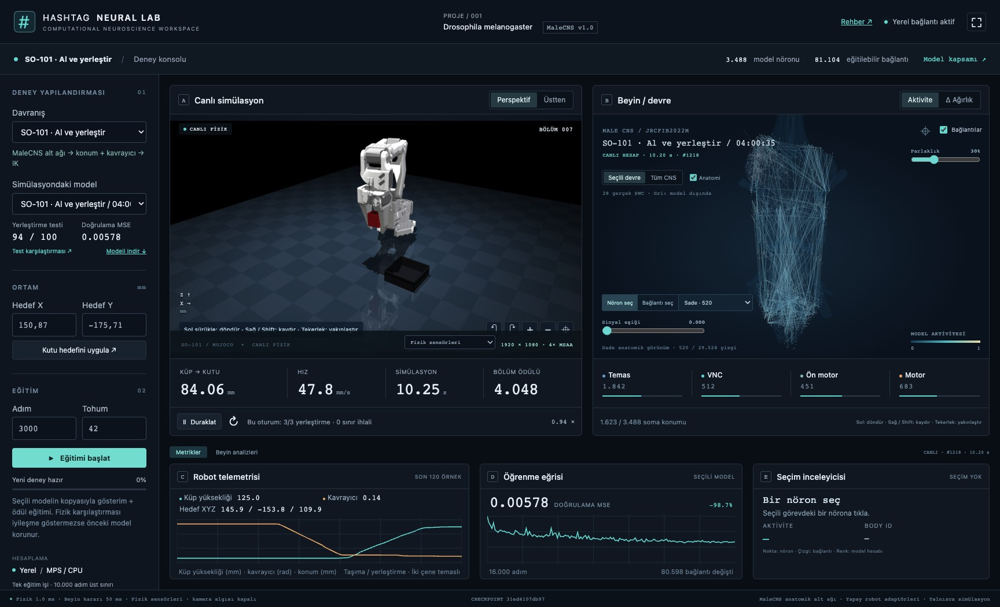

# SO-101 yerel sinir ağı deneyi

Bu çalışma yalnızca yerel simülasyon içindir. Fiziksel robot sürücüsü çağrılmaz;
GitHub veya PyPI yayını yapılmaz. Mevcut sinek görevleri ve checkpoint'leri korunur.



## Aç ve kullan

```bash
.venv/bin/python lab_server.py
```

[Yerel laboratuvarı aç](http://127.0.0.1:8766/). Doğrulanmış SO-101 kaydı
bulunduğunda laboratuvar robotla açılır. Görev menüsünden sinek deneylerine
geri dönebilirsiniz; aynı beyin, inceleme ve telemetri panelleri kullanılır.

1. **SO-101 · Al ve yerleştir** görevini seçin. Robot 30 mm küpü kavrar,
   kaldırır, kutuya taşır, bırakır ve elini geri çeker. Bölümler otomatik yenilenir.
2. Görüntüyü mouse ile döndürün, kaydırın ve yakınlaştırın. **Duraklat** hem
   fizik adımını hem ağ kararını durdurur. Görüntü 1920 × 1080 üretilir.
3. Beyindeki nörona veya bağlantıya tıklayın. Aktivite, bağlantı çarpanı,
   anatomik kimlik, bölge, ısı haritası ve X-ray görünümü aynı hesapla eşleşir.
4. Simülasyon üzerindeki sensör seçicisinden **fizik sensörleri** veya
   **sentetik RGB-D kamera** seçin. Sensör değişimi yeni bölüm başlatır.
5. Kutu hedefini milimetre olarak değiştirebilirsiniz: X 125–160, Y −180–−135.
   **Hedefi uygula** bölümü bu kutu konumuyla sıfırlar.
6. **Eğitimi başlat**, seçili konum çıktılı modelin bir kopyasında çalışır.
   Canlı gösterim seçili eski modelle devam eder. Eğitim bitince sonucu okuyun;
   yeni kaydı **Yeni modeli yükle** ile açın veya menüden önce/sonra karşılaştırın.

Yeni aday fizik karşılaştırmasını iyileştirmezse önceki ağırlıklar korunur.
Öğrenme kaybının azalması otomatik olarak daha iyi robot anlamına gelmez.
İptal edilen işin günlükleri saklanır; aktif model değiştirilmez.

## Doğrulanmış yerel sonuç

Seçilen kayıt: `models/lab_runs/local-so101-validated-seed42/`.
Checkpoint SHA-256:
`31ed4107db97458838319e4b789c259426e33a4a680b5a40348a970f6226f374`.

| Deney | Başarılı / toplam | Sınır ihlali |
| --- | ---: | ---: |
| Geliştirme: uzanma | 12 / 12 | 0 |
| Geliştirme: kaldırma | 12 / 12 | 0 |
| Geliştirme: tam yerleştirme | 12 / 12 | 0 |
| Ayrı test: eğitilmiş anatomik ağ | 94 / 100 | 0 |
| Aynı tohumlar: eğitim öncesi ağ | 0 / 100 | 0 |
| Aynı tohumlar: nöron yanıtları sıfır | 0 / 100 | 0 |
| Aynı eğitim yöntemi: anatomik çarpanlar sabit | 37 / 100 | 0 |
| Aynı tohumlar: MLP referansı | 62 / 100 | 0 |
| Sentetik RGB-D kamera ile ayrı test | 93 / 100 | 0 |
| Kavrama öncesi 150 mN, 50 ms yatay itme | 12 / 12 | 0 |
| Kaldırdıktan sonra 600 ms zorla açılan kavrayıcı | 0 / 12 | 0 |

Ana test tohumları 8000–8099; model seçimi 4000–4011 üzerinde yapıldı.
Eğitim gösterimleri 2000–2099 ve 2200–2359 aralıklarından gelir. Bölüm
kimliği beşin katı olan gösterimler eğitim doğrulamasına ayrılır.
Testten önce seçilen modelin 100 denemesinde altı başarısızlık da rapora dahildir.
Sonuç, tanımlanan küp/kutu ve çalışma alanı içindir; başka nesnelere genellenmiş
robot becerisi veya fiziksel robot başarısı değildir.

MLP referansı aynı gözlem seçimi, öğrenilmiş aşama belleği, 16.000 eğitim
adımı ve konum okuması uydurmasını kullanır; gizli katmanları 128'er birimdir.
Parametre sayıları eşit değildir. Bu tek veri kümesindeki kontrol deneyidir;
anatomik ağların genel olarak üstün olduğuna dair kanıt sayılmaz.

Ham sonuçlar `artifacts/so101/holdout-*.json`, başarısız geliştirme denemeleri
aynı dizinde, seçili sonuç özeti modelin `evaluation.json` dosyasındadır.
Zorla düşürülen küpü yeniden kavrama bu sürümde öğrenilmiş değildir.

## Kullanılan parçalar ve fizik

- Robot: yerel `SO-ARM100/Simulation/SO101/so101_new_calib.xml` ve özgün STL'ler.
- Aksesuarlar: `so101-aksesuar/v3` içindeki 30 mm kırmızı küp ve ayırma kutusu;
  siyah tag ve logo dolguları dahil gerçek renk gövdeleri gösterilir.
- Kutu: 76 × 76 × 26 mm; iç açıklık 71,2 mm, taban 2,4 mm. Çarpışma modeli
  ayrı taban/duvarlardan oluşur; boşluk tek bir dışbükey gövdeyle doldurulmaz.
- Çeneler: özgün mesh'lerin dilimler halinde dışbükey çarpışma ayrıştırması.
  Görsel STL değiştirilmez. Temas geometrisi yine bir fizik yaklaşımıdır.
- Fizik adımı 1 ms; robot kararı 50 ms. PGS, eliptik sürtünme konisi, 100 iterasyon.
  Newton çözücüsüyle kararsızlık üreten denemeler başarısız olarak kaydedildi.
- Küp kütlesi 12 g ve çene sürtünmesi 0,9 simülasyon varsayımlarıdır;
  basılı parçanın gerçek kütlesi/sürtünmesi ölçülmüş değildir.
- Robot eklem sınırları korunur; kavrayıcı torku 0,25 Nm ile sınırlandırılır.
  Yerçekimi, sıfır hızlı model hesabından pozisyon servosuna sınırlı ileri besleme
  olarak eklenir. Nesneler için yerçekimi kapatılmaz ve taşıma kuvveti eklenmez.

Nesnenin konumu yalnızca bölüm sıfırlamada atanır. Taşıma sırasında `qpos`
değiştirme, kaynak, weld, mocap ile taşıma veya kavrama yardımcısı yoktur.

## Ağın yaptığı iş

MaleCNS Touch → VNC ara → VNC ön motor → Motor alt devresi, SO-101 için
yeniden amaçlandırılır: **3.488 nöron ve 81.104 yönlü bağlantı**.
30 robot/görev özelliği kaydedilir. Seçilen giriş adaptörü bunlardan 15'ini
kullanır: kavrayıcı konumu, uç nokta/nesne/hedef geometrisi ve temas/ilerleme
işaretleri. Kol açıları, hızları ve önceki komutlar bu adayın öğrenilmiş
hareketinde kullanılmaz; bu açık özellik seçimi kontrol yolunu ezberlemeyi azaltır.

Sekizli öğrenilmiş aşama okuması, bir sonraki kararın girişine geri beslenir.
Bu bellek mühendislik ekidir; anatomik nöron sayısına katılmaz. Dört katmandaki
nöron yanıtları bağımsız sigmoid hesaplarıdır. Seçilen modelde üç anatomik
katmanın mevcut bağlantı çarpanları, giriş adaptörü ve hareket okuması eğitilir.
Çarpanlar exp(−1,5)–exp(1,5) aralığındadır. 80.598 bağlantının çarpanı
başlangıca göre %0,1'den fazla değişmiştir. **Yeni anatomik bağlantı eklenmez.**
İç devreyi atlayarak hareket üreten bir yan yol yoktur.

Seçilen modelin çıktısı dört değerdir: **uç noktanın hedef X/Y/Z konumu ve
kavrayıcı**. Konum okuması da gösterimlerden öğrenilir; canlı yolda öğretmen,
hazır konum listesi veya zamanlanmış görev betiği yoktur. Konum hedefi sınırlı
oransal izleme, ters kinematik ve servolardan geçer; karar başına istenen
ilerleme en fazla 3 mm'dir. Eski araştırma adaylarının ΔXYZ çıktıları da
checkpoint şemasıyla desteklenir. Ters kinematik ile servo kontrolü ayrı
mühendislik katmanlarıdır. Bu, sineğin doğal kol kontrol devresi
veya yaşayan bir beynin aktarımı değildir. Girdi kodlaması biyolojik dokunma
reseptörlerini taklit ettiği iddiası taşımaz.

Başka araştırma adaylarında sekiz ayrı öğrenilmiş hareket okuması veya
gösterimlerden çıkarılan aşama geçiş izinleri denenmiştir. Seçilen son model
tek hareket okuması kullanır ve bu geçiş izinlerine ihtiyaç duymaz. Bunlar
kontrolcü mimarisi seçenekleridir; sineğin anatomisine yeni devre eklemek değildir.

UI'daki nöron değerleri, robot hareketini üreten son ileri hesaplamadan gelir.
Bağlantı katkısı `yanıt kazancı × kaynak aktivitesi × mevcut ağırlık / hedefe
gelen ağırlık toplamı` olarak hesaplanır. Katmanların sabit eşik terimi bağlantı
katkısına dahil edilmez. Bunlar aksiyon potansiyeli veya ölçülmüş voltaj değildir.

3B atlas üzerinde gerçek soma koordinatı bulunan 1.623 nöron ve iki ucu da
konumlu 29.528 bağlantı çizilebilir. Konumu eksik hücrelere hayalî anatomik
konum atanmaz. Canlı hesap ve katman ortalamaları 3.488 nöronun tamamını içerir;
özellikle giriş duyusal hücrelerinin eksik soma konumu, çalışmadıkları anlamına gelmez.

## Eğitim ve değerlendirme

Önce temas fiziğiyle başarılı öğretmen gösterileri üretilir. Eğitim ve doğrulama
bölüm kimliğiyle ayrılır; komşu kareler rastgele iki kümeye bölünmez. Uzanma,
kaldırma ve tam yerleştirme sırasıyla öğrenilir ve fizik içinde ayrıca sınanır.
Ağın ziyaret ettiği hatalı durumlar için açıkça işaretlenmiş öğretmen
müdahaleleriyle düzeltme verisi toplanabilir (DAgger).

Seçilen son modelin eğitimi: 98 başarılı temiz gösterim + 159 başarılı,
küçük hareket sapmaları içeren gösterim; toplam 92.683 kare. 16.000 optimizasyon
adımından sonra yalnızca XYZ okuması, eğitim bölümlerindeki hedef konumlarına
ridge regresyonuyla uyduruldu (λ = 0,0001). Anatomik çekirdek, kavrayıcı ve
aşama okuması bu son uydurmada sabit kaldı. Hedef etiketleri, kayıtlı öğretmen
komutlarıyla bütün karelerde karşılaştırıldı; en büyük normalize fark 0,0000011.

Ödül, sayısal geri bildirimdir: kavrama, kaldırma, bırakma ve tam başarı için
birer kez puan; ilerleme için sınırlı puan; zaman, hareket ve yasak temas için
ceza. Şeker maddesi kullanılmaz. PPO ile gerçek ödül gradyanı denemeleri ayrı
adaylara kaydedilir. Son seçili checkpoint gösterim + konum okuması eğitimidir;
ödül güncellemesi uygulanmış adayla karıştırılmamalıdır.

UI'daki devam eğitimi mevcut modelin kopyasını alır, uzanma/kaldırma kontrolü,
gösterim eğitimi, konum okuması uydurma ve 3 × 4 bölümlük PPO denemesi yapar.
Adaylar aynı 12 geliştirme konumunda karşılaştırılır; eşitlikte eski model
korunur. Ardından 100 konumda seçilen model, eğitim öncesi kopya ve susturulan
nöron kontrolü ölçülür. Tohum 70 için bu son test 17000–17099'dur.
Bir işi iptal etmek veya aşama kapısında durmak başarı sayılmaz.

Eğitim hatasının düşmesi görev başarısı sayılmaz. Tam başarı: küpün bütün
izdüşümü kutu içinde, nesne serbest ve durgun, kavrayıcı en az 65 mm uzakta;
bu durum 0,5 saniye sürmeli ve yasak temas / fizik uyarısı bulunmamalıdır.
Ödüller ve aşama işaretleri fizik ölçümlerinden hesaplanır. Ara başarı
ödülleri bölüm başına bir kez verilir.

Geliştirme denemeleri ve başarısız adaylar `artifacts/so101/` altında tutulur.
Checkpoint'ler `models/lab_runs/` altındadır. Son test kümesi, eğitim ve model
seçiminde kullanılan tohumlardan ayrı olmalıdır.

## Kamera gözlemi

Kamera modunda kırmızı küp RGB görüntüsünde bulunur; **sentetik derinlik** ve
kamera kalibrasyonuyla 3B merkez tahmin edilir. Küpün 30 mm olduğu bilinir.
Kavrama sırasında görünmeyen yüzler için eklem konumundan hareket tahmini ve
görüntü birleştirilir. Bu, nesneye fiziksel bağ/kuvvet eklemez. Algı katmanı
küpün MuJoCo gövde konumunu veya segmentasyon kimliğini okumaz.

Robot eklemleri ve temas bilgisi simülasyon sensörlerinden, kutu hedefi bilinen
kalibrasyondan gelir. Kutu görüntüden keşfedilmez. Görüntü kaybı 0,5 saniyeyi
aşarsa hareket durur; gizlice kusursuz nesne konumuna geçilmez. Bu sistem sıradan
tek RGB kamera ile gerçek robota hazır algılama çözümü değildir.

Başarı ve hata metrikleri kamera modunda da fizik durumundan ölçülür; bu
değerlendirme değerleri nesne konumu olarak politikaya geri verilmez.

## Yerel hazırlık

Var olan bilimsel `.venv` kullanılır; kökte `uv sync` çalıştırarak bu ortamı
hafif paket ortamıyla değiştirmeyin. Ek geometri bağımlılığı:

```bash
uv pip install --python .venv/bin/python -r so101/requirements.txt
```

Varsayılan varlık yolları aşağıdadır; farklı makinede ortam değişkenleriyle
değiştirilebilir. Ana aksesuar dosyaları mm, MuJoCo robot mesh'leri metredir.

```bash
export SO101_MODEL_DIR="$HOME/.cache/robot_descriptions/SO-ARM100/Simulation/SO101"
export SO101_ACCESSORIES_DIR="$HOME/so101-aksesuar/v3"
```

Kayıtlı veriyle seçilen mimariyi yeniden eğitmek:

```bash
.venv/bin/python -m so101.train \
  --output models/lab_runs/my-so101 \
  --dataset artifacts/so101/target-demonstrations.npz \
  --stage place --steps 16000 --seed 42 --learning-rate .001 \
  --memory --all-core --task-features --position-loss-weight 1
.venv/bin/python -m so101.fit_readout models/lab_runs/my-so101/trained.npz \
  --dataset artifacts/so101/target-demonstrations.npz
.venv/bin/python -m so101.evaluate models/lab_runs/my-so101/readout-0.0001.npz \
  --episodes 100 --start-seed 8000 --output artifacts/so101/my-evaluation.json
```

Veri yoksa `.venv/bin/python -m so101.train_job --output models/lab_runs/my-curriculum --steps 8000`
temas gösterimlerini üretir ve sıfırdan aşamalı eğitimi dener. Her aşama en fazla
dört deneme yapar; test kapısı geçilemezse hata ve aday dosyaları korunur.
Gösterim üretiminde `so101.demonstrations`, delta etiketlerinden hedef etiketlerine
doğrulanmış dönüşümde `so101.target_demonstrations` kullanılır.

Mevcut modeli kopyalayarak UI ile aynı devam eğitimi:

```bash
.venv/bin/python -m so101.train_job \
  --output models/lab_runs/my-refinement --steps 3000 --seed 70 \
  --resume models/lab_runs/local-so101-validated-seed42/trained.npz
```

## Kaydet ve başka ortamda kullan

UI'daki model indirme düğmesi checkpoint, anatomik matrisler, nöron kimlikleri,
giriş ölçekleri/özellik seçimi, öğrenilmiş bellek, çıkarım kodu, şema ve dosya
hash'lerini içeren ZIP üretir. ZIP içinde `python infer.py` örneği bulunur.
Çıkarım yalnızca NumPy/SciPy ister; MuJoCo veya PyTorch şart değildir.

Aynı `Policy` nesnesini kararlar boyunca koruyun, yeni bölümde `reset()` çağırın.
Her karar 30 özellik alır ve dört normalize kontrol değeri döndürür. Konum
modunda metre hedefi `merkez + ölçek × çıktı` ile hesaplanır; tam sıra/birimler
`observation-schema.json` içindedir. CLI örneği yalnızca sayısal çıkarımdır,
robot hareketi başlatmaz. Model başka yazılımda kullanılabilir; başka robotun
gözlem/aksiyon sözleşmesine kendiliğinden uyum sağlamaz.

## Gerçek robota geçmeden önce

Bu deney gerçek SO-101'e doğrudan yüklenmez. Kamera/nesne konumu eşlemesi,
eklem sırası, derece/radyan dönüşümü, kavrayıcı yönü, mevcut kalibrasyon,
çalışma alanı, hız sınırları, gecikme, bağlantı kesilince durma ve acil durdurma
ayrıca doğrulanmalıdır. Simülasyondaki kusursuz nesne durumunun gerçek karşılığı
bir algılama sistemi gerektirir. Fiziksel denemeler bu yerel çalışmanın dışındadır.
