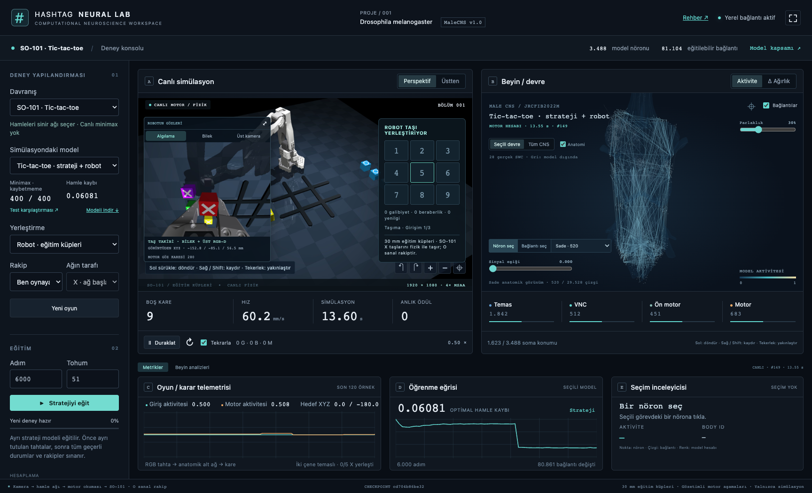

# SO-101 · Tic-tac-toe laboratuvarı

Bu yerel deney iki ayrı yeteneği ölçer: **hamleyi seçmek** ve **taşı yerleştirmek**.
Sanal tahtadaki başarı robotun taş yerleştirme başarısı değildir.



## Kullanım

Laboratuvarda **Davranış → SO-101 · Tic-tac-toe** seç.
Yerel hazır model **Tic-tac-toe · strateji + robot**. İki yerleştirme modu bulunur:

- **Robot · eğitim küpleri:** SO-101, X işaretli 30 mm küpleri temas fiziğiyle taşır. Ağ X oynar;
  insan veya otomatik rakibin O taşı sanal olarak yerleştirilir.
- **Sanal tahta · özgün X/O:** özgün basılı parçalar gösterilir; taş konumları yazılımla atanır.
  Bu modda ağın X veya O olmasını seçebilirsin.

**Rakip → Ben oynayayım** seç ve **Yeni oyun** düğmesine bas.
X başlar. Sıra sana geldiğinde simülasyon üzerindeki dokuz kareden birine tıkla.
Rastgele rakip ve ağın kendisiyle oynaması seçenekleri de vardır. **Tekrarla**, otomatik
rakiple biten oyunlardan sonra yeni oyun başlatır; insanlı oyunda yeni oyunu sen başlatırsın.

Sağdaki nöronlar, gösterilen kararın gerçek ileri hesaplamasından gelir. İnsan sırasındayken
gösterilen skorlar o taraf için ağın analizidir; insanın yerine hamle uygulanmaz.
**Algılama / Üst kamera** sekmeleri son strateji kararına giren kareyi gösterir.
**Bilek** sekmesi kolun bileğine bağlı kameranın güncel görüntüsüdür. Kare numaraları ayrı gösterilir.
Üst kamera stratejinin tahta gözlemidir; bilek ve üst RGB-D motor deneyinde nesne takibi için kullanılır.
Motor hareketi sırasında gösterilen nöronlar motor hesabına, hamle seçerken strateji hesabına aittir.
Grafikte giriş ve motor katmanlarının ortalama aktivitesi, robot modunda uç nokta hızı ve gerçek
simülasyon zamanı görünür. Görüş kapandığında kısa süreli temas/son konum tahmini açıkça etiketlenir.

## Gerçekte ne eğitiliyor?

MaleCNS verisindeki **3.488 nöron / 81.104 mevcut bağlantı** içeren Touch → VNC → Motor
alt grafiği yapay bir görev için yeniden kullanılır. Bu yaşayan beyin veya tam sinek beyni değildir.
Tahtadaki kendi taşı / boş / rakip taşı durumları 27 girişe kodlanır. Döndürme ve yansıtma
eşdeğerleri aynı koordinat düzenine taşınır. Kodlayıcı, üç anatomik katmanın bağlantı kazançları
ve dokuz karelik çıkış okuması eğitilir. Yeni anatomik bağlantı eklenmez.

Canlı strateji `tictactoe/policy.py` içindedir. Burada minimax, LLM, hamle tablosu veya
taktik düzeltme bulunmaz. Dokuz öğrenilmiş skor boş kare maskesinden geçer; en yüksek skor seçilir.
Kurallar sırayı, dolu kareleri ve oyun sonunu doğrular; strateji üretmez.

Minimax yalnızca `teacher.py` ve eğitim/değerlendirmede kullanılır. Önce simetri grupları
ayrılmış eğitim/doğrulama, ardından sonlu oyun uzayının tamamıyla eğitim yapılır.
Son modelin tam tahta kapsamı, görülmemiş veri genellemesi diye sunulmaz.
Canlı oyun sırasında ağırlıklar sabittir. **Stratejiyi eğit** yeni bir model dosyası oluşturur;
küp taşıma modeli ve önceki oyun modelleri korunur.

## Yerelde yeniden eğitme

Mevcut bilimsel Python ortamını kullan. Kök ortamda `uv sync` çalıştırma; yerel robot/sinek
bağımlılıkları paketleme ortamından ayrıdır.

```bash
.venv/bin/python -m tictactoe.train \
  --output models/lab_runs/my-tictactoe \
  --steps 6000 --seed 51
```

200–10.000 adım sınırı vardır. Çıktılar: `trained.npz`, `untrained.npz`, `circuit.json`,
`training.json`, `evaluation.json` ve `boards.npz`. UI'daki **Yeni modeli simülasyona al**
düğmesi veya model seçimi ile karşılaştır. CLI üzerinden eğitim tamamlandıysa sayfayı yenile.
UI'nın oyun için başlangıç ayarı 6.000 adım / tohum 51'dir. Eğitim seçili canlı modeli değiştirmez.
Yeni stratejinin motor bağlantısı otomatik devralınmaz; değişen ağ için motor okuması yeniden
öğrenilmeli ve temas testleri geçmelidir:

```bash
.venv/bin/python -m tictactoe.motor \
  --source models/lab_runs/my-tictactoe \
  --output models/lab_runs/my-tictactoe-robot --seed 52

.venv/bin/python tools/evaluate_tictactoe_motor.py \
  --model models/lab_runs/my-tictactoe-robot/trained.npz \
  --output models/lab_runs/my-tictactoe-robot/acceptance.json --register
```

`--register`, dokuz hedef, ardışık tam oyun ve motor susturma kontrolü geçerse modeli UI'ya ekler.
Geçmezse rapor ve aday dosyaları korunur. Her eğitim için yeni dizin kullan; mevcut modelin üstüne
yazmak reddedilir. Motor doğrulaması simülasyon çalıştırır ve birkaç dakika sürebilir.

**Modeli indir** yalnızca taşınabilir strateji çıkarımını ZIP olarak verir; robot sürücüsü içermez:

```bash
python -m pip install numpy scipy
python infer.py 0 0 0 0 0 0 0 0 0
```

Kareler satır sırasındadır: 0 boş, 1 X, -1 O. Sonuç sıfır ve bir tabanlı kare numarasıdır.
Taşınabilir çıkarımda öğretmen dosyası bulunmaz. Paket dağıtımı yerel eğitilmiş modelleri içermez.

## Kaydedilen strateji deneyi

`local-tictactoe-seed51`, 6.000 adım:

| Ölçüm | Sonuç |
| --- | --- |
| İlk aşama: ayrı tutulan 125 simetri grubunda optimal hamle | %96,8 |
| Son model: 4.520 geçerli karar durumunda optimal hamle | 4.520 / 4.520 |
| Rastgele rakip, iki rol, 400 oyun | 352 galibiyet / 48 beraberlik / 0 yenilgi |
| Minimax rakip, iki rol, 400 oyun | 400 beraberlik / 0 yenilgi |
| Bütün olası rakip cevapları, boş tahtadan X ve O | İki rolde de en kötü sonuç beraberlik |
| Dört nöron katmanı sıfır, rastgele rakip, 400 oyun | 96 galibiyet / 37 beraberlik / 267 yenilgi |
| Eğitimsiz ağ, aynı rastgele rakip koşulları, 400 oyun | 185 galibiyet / 18 beraberlik / 197 yenilgi |

İlk aşamadaki ölçüm model seçimi için kullanılan doğrulama kümesidir. Son model bu grupları da
eğitimde görür. Susturma deneyinde öğrenilmiş çıkış sabitleri ve boş kare maskesi korunur.
Bu sonuçlar bu sonlu oyun, kurallar ve kayıtlı modele aittir; genel zekâ kanıtı değildir.

Yerel motor modeli `local-tictactoe-robot-seed53`, aynı stratejiyi aynen korur
(motor okumasının eğitim tohumu 52'dir). Sabit çalışma alanında kaydedilen MuJoCo deneyi:

| Ölçüm | Sonuç |
| --- | --- |
| İlk X taşını dokuz hedef kareye ayrı ayrı yerleştirme | 9 / 9, ilk girişimde |
| Ardışık öz-oyun: beş ayrı X taşını taşıma | 5 / 5, ilk girişimde; dokuz hamlede beraberlik |
| Motorun dört nöron katmanı susturulduğunda merkez hedef | Başarısız; geçersiz hedef çalışma sınırında durduruldu |

Tekrarlanabilir sabit yerleşim testleridir. Bütün oyun dizileri, karışık taş yerleşimleri,
keyfî düşürmeler veya gerçek robot üzerinde genel başarı oranı olarak yorumlanmamalıdır.
UI'nın test karşılaştırması, seçili modelin strateji ve motor raporlarını ayrı gösterir.

## Robot ve geometri sınırı

Özgün 240 mm tahta ve 52 × 52 × 8 mm X/O çizimleri Mert'in tic-tac-toe projesinden,
kaynak SCAD ve CERN-OHL-P-2.0 lisansıyla alınmıştır. `tictactoe/assets/provenance.json`
kaynak revizyonu ve dosya özetlerini taşır. STL'ler çalışma zamanında geometrileri korunarak
MuJoCo'nun okuyabildiği ikili STL biçimine çevrilir.

**Sanal tahta** modunda taş konumları hamle uygulamasıyla atanır; bu motor becerisi değildir.
Özgün ince X taşlarında temas oluşmasına karşın kaldırma denemeleri başarısız oldu.
Bu geometriye otomatik motor başarısı atfedilmez. Motor deneyi 30 mm eğitim küpleri ve
X/O işaretleriyle ayrı yürütülür; parçaların geometrisi UI'da açıkça belirtilmelidir.
Eğitim küplerinin besleme alanı kolun sol tarafındadır. Sabit renk paleti ve son görülen konum
birlikte nesne eşleştirmesi yapar; bu genel nesne tanıma veya keyfî dağınıklıkta kavrama değildir.

Robot motor adaptörü aynı anatomik ağırlıklardan geçer; sentetik hedef örnekleriyle ayrı
bir konum okuması öğrenir. Dokuz görev aşamasını belirleyen gözetmen, ters kinematik,
hız sınırları, temas kontrolü ve tekrar sınırı deterministik yazılımdır.
Bu nedenle tüm hareket sıralamasının bağımsız öğrenildiği iddia edilmez.
Motor girdisi kamera konum kestirimi, kalibre hedef ve görev aşamasıdır. Aynı 3.488 nöronlu
çekirdekten geçen ayrı kodlayıcı ve konum okuması kullanılır; anatomik ağırlıklar strateji
eğitiminden sonra motor uyarlamasında sabit kalır. Kodlayıcı rastgele sabittir; motor çıkış
okuması 4.000 sentetik geometri örneğiyle öğrenilir ve 1.000 ayrı örnekte ölçülür.

Kontrol edilen X taşının konumu hareket boyunca atanmaz; kavrama, taşıma ve bırakma temasla
oluşur. Başarı için taşın beklenen karede durması, kolun uzaklaşması ve kameranın tahtayı
doğrulaması gerekir. Kamera konum kestirimine gizli nesne koordinatı verilmez; simülatörün
nesne koordinatı yalnızca bağımsız son durum ve güvenlik kontrolündedir. Üç girişim / 60
simülasyon saniyesi sınırı vardır. Park dönüşünde kalibre eklem çözümü, hareket boyunca
servo hız/kuvvet ve çarpışma sınırları kullanılır.

Kamera görüntüleri MuJoCo'dan gelir. Derinlik sentetiktir; gerçek UVC modülü yalnızca RGB
sağlar. Gerçek robotta tahta/lens kalibrasyonu, algılama, kuvvet ve hız sınırları, kamera
gecikmeleri ve düşük güç denemeleri ayrıca doğrulanmalıdır. Bu deney fiziksel robotu açmaz.

## Kontroller

```bash
.venv/bin/python -m unittest discover -s tests/scientific -p test_tictactoe.py -v

SO101_TEST_ASSETS=1 .venv/bin/python -m unittest discover \
  -s tests/scientific -p test_tictactoe.py -v
```

Kurallar, geçersiz hamleler, simetri dönüşümü, Torch/NumPy eşleşmesi, anatomik maske,
öğretmensiz taşınabilir çıkarım ve eski tahta üstüne gönderilen hamlelerin reddi sınanır.
İkinci komut kameranın iki geometride tüm kareleri okumasını ve benzer renkli, önceden
yerleştirilmiş taşları sıradaki taşla karıştırmamasını da sınar.
