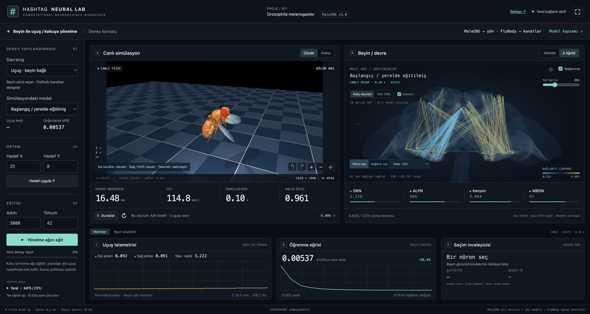

# Eğitim ve deney rehberi

**Amaç:** yeni bir yönelme modeli üretmek, fizik testini görmek ve eski kayıtla
aynı koşullarda karşılaştırmak. Bu rehberdeki adımlar mevcut UI ile yapılır.

[Rehber dizini](README.md) · [Kurulum](installation.md) · [Kullanım](usage.md) · [Eğitim](training.md)

## İlk yürüyüş eğitimi

Akış: **başlangıcı izle → eğit → fizik testini bekle → yeni modeli yükle → karşılaştır**.

1. `fruitfly ui` açın. **Kokuya yönelme → Eğitim öncesi** modelini seçin.
2. Hedefi **X=12, Y=4** yapıp **Hedefi uygula** seçin; başlangıç hareketini izleyin.
3. **Adım=3000**, **Tohum=42** yazıp **Eğitimi başlat** düğmesine basın.
4. MSE grafiğini izleyin. Aynı anda bir iş çalışır; adım aralığı 200–10.000'dir.
   Eğitim + değerlendirme 600 saniyeyle sınırlıdır. Yavaş cihazda daha az adım deneyin.
5. Eğitimden sonra altı ayrı fizik koşulu değerlendirilir. **Tamamlandı** durumunu
   bekleyin; “değerlendiriliyor” henüz bitmiş değildir.
6. **Yeni modeli simülasyona al** seçin. Başka hedefleri deneyin, eski modeli
   menüden geri alarak karşılaştırın.
7. **Δ Ağırlık** ile değişen katsayıları, **Aktivite** ile canlı yanıtı inceleyin.

`3000/42` başlangıç önerisidir, başarı garantisi değildir. Tohum tekrarlanabilirliği
artırır; cihaz/BLAS/MPS farklılıkları sayısal sonucu değiştirebilir.

## Ne öğreniliyor?

İki antenin sentetik koku yoğunluğu giriş olur. ORN → ALPN → Kenyon → MBON gerçek
MaleCNS topolojisine bağlanır. Program koku gradyanı örnekleri üretir; öğretmen
kuralı sağ/sol yön komutu verir. Ağ bunları **denetimli taklit öğrenmesiyle** öğrenir.

Mevcut KC→MBON bağlarının sınırlı çarpanları ve yapay motor okuması değişir.
Nöron kimlikleri, bağlantıların varlığı, diğer anatomik katmanlar ve gövde
kontrolcüleri korunur. **Yeni anatomik kenar üretilmez**. “Beynin yeni hali” burada
yeni katsayıları taşıyan checkpoint'tir.

Her iş 2.048 sentetik eğitim, ayrı 512 doğrulama örneği kullanır. Hedef X/Y bu
veri kümesini değiştirmez. Her yeni iş aynı anatomik başlangıçtan başlar; seçili
checkpoint'ten fine-tuning yapılmaz. Yeni koku kimliği, ödül tasarımı veya kendi
veri kümenizi eklemek kod değişikliği ve yeni değerlendirme gerektirir.

## Uçuş yönelmesi

1. Uygulamayı `Ctrl+C` ile durdurup `fruitfly setup flight` çalıştırın. Alternatif:
   `fruitfly ui --setup` ekranında **Uçuşu kur**.
2. Laboratuvarda **Uçuş · beyin bağlı** seçin. İlk geçişte yürüyüşte seçili ağ
   aktarılır; model menüsünden başka kayıt seçebilirsiniz.
3. **X=25, Y=8** gibi ileri bir hedef deneyin. Sinek havada başlar.
4. Adım/tohum girip **Yönelme ağını eğit** seçin. Aynı ağ eğitilir; bu kez altı
   uçuş koşulunda test edilir.
5. Yeni modeli yükleyin; aktivite, anten, yön, irtifa ve kanat telemetrisini birlikte okuyun.

Zincir: anten → MaleCNS alt ağı → MBON yön okuması → sınırlı yön referansı →
hazır FlyBody kanat politikası → MuJoCo fiziği → yeni anten konumu.
Eşit koku girdisindeki nötr değer çıkarılır; yön kazancı 60, sınırı ±8 rad/s'dir.
Beyin 10 ms, kanat kontrolü 0,2 ms, fizik 0,05 ms adımlarıyla çalışır.
Kanat politikası, irtifa, kalkış ve iniş bu eğitimle öğrenilmez. Bir yürüyüş
checkpoint'inin uçuşta başarısı varsayılmaz; görev testi ayrı okunur.

## Sonucu değerlendirme

MSE azalması sentetik komutların daha iyi taklit edildiğini gösterir. Fizik testi
bunun gövdede işe yarayıp yaramadığına dair küçük bir sınamadır. **6/6 bile genel
başarı oranı değildir.** Yeni cihazda veya hedefte aynı sonuç garanti edilmez.

| Test | Koşullar |
| --- | --- |
| Yürüyüş | `(12,±4)`, `(10,±5)`, `(14,±3)` mm; tohumlar 10–15 |
| Uçuş | `(22,±6)`, `(28,±9)`, `(24,±10)` mm; tohumlar 101–106 |

Serbest hedef bu sabit listeyi değiştirmez. Küçük karşılaştırma için adım sayısını
koruyup tohumları 42/43/44 deneyin; MSE, başarı, düşme ve son uzaklığı birlikte
kaydedin. Yalnızca en iyi koşuyu genel başarı diye sunmayın.

## Kayıtlar

UI işleri `models/lab_runs/run-<UTC zaman damgası>/` içine ayrı kaydolur:

| Dosya | İçerik |
| --- | --- |
| `run.json` | Kimlik, görev, adım, tohum, iş durumu |
| `trained.npz`, `untrained.npz` | Eğitim sonrası/öncesi ağırlık ve motor okuması |
| `circuit.json`, `body_ids.npz`, `layer*.npz` | Devre kimliği ve anatomik katmanlar |
| `training.json` | MSE geçmişi ve değişen katsayı sayısı |
| `evaluation.json` | Göreve özgü fizik sonuçları |
| `training.log`, `tensorboard/` | Günlük ve eğitim olayları |

Taşırken bütün koşu klasörünü ve kaynak sürümünü koruyun. UI uyumlu `complete`
koşularını listeler. Uygulama açıkken dosyaları elle değiştirmeyin. Durdurma veya
kapanma önceki başarılı koşuları silmez; yarım iş başarılı model olarak sunulmaz.
Yarım eğitim adımından otomatik devam edilmez; yeni iş başlatabilirsiniz.

## Bilimsel sınırlar

Anatomi gerçektir; aktivite hesaplama modelinin yanıtıdır. Fizyolojik uyarıcı/
baskılayıcı işaret, tekrarlayan dinamik, spike, gecikme, reseptör/koku kimliği ve
biyolojik plastisite modellenmez. İskelet örnekleri tam sinir sistemi değildir.
Isı/kesit görünümleri hesaplanan yanıtın görselleştirmesidir. Bu laboratuvar bu
sınırlı varsayımlarla deney yapmak içindir; yaşayan sineğin bütün beyninin veya
biyolojik öğrenmesinin yeniden üretildiğini iddia etmez.

## Sonucunuzu karşılaştırın

[Deney kayıtları](experiments.md) başarısız hedefleri de içerir.
[Önce/sonra yürüyüş videosu](media/walking-comparison.mp4) tek koşulu gösterir;
[uçuş rehberi](../flight/README.md) aynı ağın ayrı motor adaptörünü açıklar.
