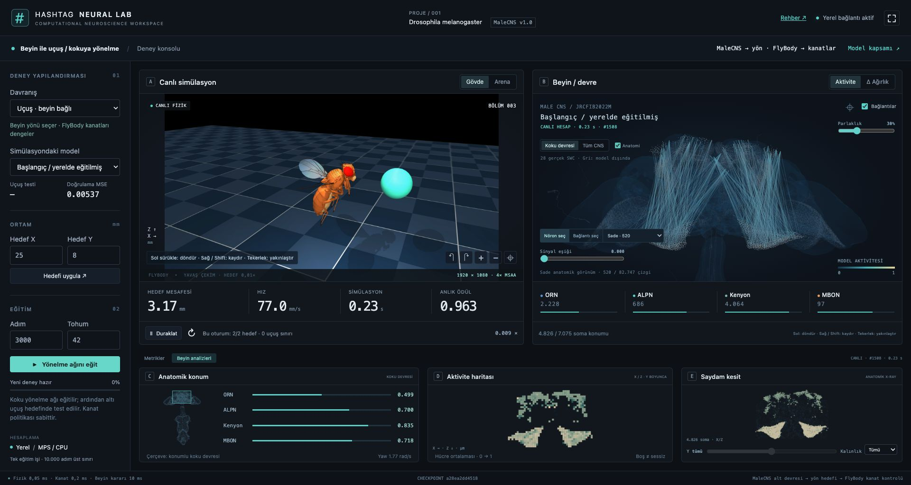
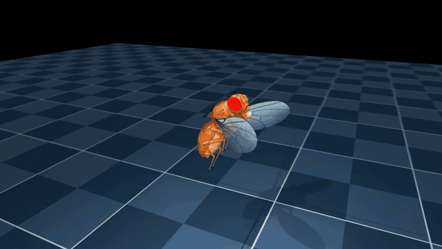

# Beyne bağlı uçuş

**Aynı yönelme devresi, farklı gövde kontrolcüsü.** MaleCNS kaynaklı alt ağ kokuya
göre yönü seçer; FlyBody'nin hazır politikası kanatları ve uçuş dengesini yönetir.



[Kurulum](../docs/installation.md) · [Eğitim](../docs/training.md) · [Ölçümler](../docs/experiments.md) · [Tüm rehberler](../docs/README.md)

## Önce uçuşu açın

```bash
fruitfly setup walking
fruitfly setup flight
fruitfly ui
```

UI kurulum ekranındaki **Beyni indir ve kur → Uçuşu kur → Laboratuvarı aç**
düğmeleri aynı işlemleri yapar. Bilimsel uçuş ortamı Python 3.11 / TensorFlow ile
ayrı kurulur; yürüyüşün Python 3.12 ortamını değiştirmez. Resmi politika ve referans
arşivleri yaklaşık 19,4 MB'dir; Python bağımlılıkları ek alan ister.

Laboratuvarda **Davranış → Uçuş · beyin bağlı** seçin. **X=22, Y=6 mm** ile
başlayın, **Hedefi uygula** düğmesine basın. **Gövde** kanatları yakından,
**Arena** hedefle ilişkiyi gösterir. Sol sürükleme döndürür, sağ/Shift sürükleme
kaydırır, tekerlek yakınlaştırır. Duraklatılmış fizikte de kamera çalışır.



*Kayıt: tohum 10, hedef `(22, 6)` mm, 3.000 adımlık yönelme modeli. 720p kaynak,
0,03× oynatım. [MP4](../docs/media/flight.mp4). Canlı UI 1920×1080 / 4× MSAA
üretir ve yaklaşık 0,01× oynatımı hedefler; gerçek hız RTF alanındadır.*

## Beyin uçuşa nereden bağlanıyor?

```text
Fizikteki iki anten konumu → sentetik koku yoğunlukları
→ ORN → ALPN → Kenyon → MBON → öğrenilmiş yön okuması
→ nötr kalibrasyon → sınırlanmış yön hızı
→ çevrimiçi yön / konum referansı → hazır FlyBody kanat politikası
→ kanat eylemleri → MuJoCo fiziği → yeni anten konumları
```

Yürüyüş ve uçuş aynı `odor_policy.Policy` hesabını ve checkpoint biçimini kullanır.
Motor adaptörü `yaw = clip(60 × clip(readout − neutral, −1, 1), −8, 8)` rad/s
uygular. `neutral`, aynı modelin `[0.1, 0.1]` eşit koku girdisindeki okumasıdır.
Hedef açısı bu okumanın yerine gizlice verilmez. Bu bağlantı bir mühendislik
adaptörüdür; biyolojik MBON→kanat devresinin keşfedildiği anlamına gelmez.

| Saat / nicelik | Değer | Nasıl yorumlanır? |
| --- | --- | --- |
| MuJoCo fizik adımı | 0,05 ms | Aerodinamik ve gövde hesabı |
| Kanat kontrolü | 0,2 ms | Hazır politikanın eylem üretmesi |
| Beyin / anten hesabı | 10 ms | Son karar, bir sonraki örneğe kadar korunur |
| Referans hız / irtifa | 100 mm/s / 10 mm | Sabit görev ayarları; öğrenilmiş irtifa değil |
| Hedef başarısı | XY uzaklığı <2 mm, geçerli uçuş | Bölüm üst sınırı 0,45 simülasyon saniyesi |
| Kaynak birimleri | cm / gram / saniye | UI konum ve hızı mm'ye çevirir |

UI'nin 7.075 yanıtı kullanılan yön hesabından gelir. Checkpoint SHA256, devre
kimliği, fizik zamanı ve beyin örnek zamanı birlikte izlenir. Nöron yanıtları
biyolojik voltaj veya spike değildir; beyin örneği gövde zamanından en fazla
bir beyin adımı geridedir. Reset karesindeki hazır ama henüz uygulanmamış karar
telemetride ayrıca işaretlenir.

## Uçuş seçiliyken eğitim

**Adım=3000, Tohum=42 → Yönelme ağını eğit → altı hedef testini bekle → Yeni
modeli simülasyona al.** Ardından **Δ Ağırlık** görünümünü açın. Yeni koşu ayrı
klasöre kaydedilir. Başka modele geçmek eski kaydı silmez.

Eğitim aynı anatomik başlangıçtan yeni bir yönelme ağı üretir. Mevcut KC→MBON
çarpanları ve yapay yön okuması değişir; kanat politikası sabittir. Model yürüyüşte
de seçilebilir; her davranışın fizik skoru ayrıdır. Test yoksa skor boş kalır.

## Kontrol edilen sonuç ve sınırları

3.000 adım / tohum 42 modeli altı kısa uçuş hedefinde **6/6**, sıfır sınır ihlali
verdi. Ayrı 6.000 adımlık modelde aynı iki koşul, beyin çıkışı bağlıyken **2/2**,
sıfırlandığında **0/2**, ters çevrildiğinde **0/2** oldu. Checkpoint'ler ve koşullar
[deney kaydında](../docs/experiments.md) ayrı tutulur.

Sinek **havada başlar**. Yerden kalkış, iniş, irtifa seçimi, türbülans, uzun rota,
tüm MaleCNS dinamiği ve biyolojik öğrenme doğrulanmış özellikler değildir.
Başarılı kısa hedef testi serbest uçuş genellemesi değildir.

## Teknik değerlendirmeyi tekrarlamak

Kurulu çalışma dizininde, UI eğitim işi yokken:

```bash
cd ~/.fruitfly-hashtag
flight/.venv/bin/python flight/evaluate_navigation.py \
  --model models/odor_navigation/trained.npz --causal
```

Rapor `artifacts/lab/flight/checkpoints/<sha256>.json` içine yazılır. `--causal`
seçeneği sonucu varsaymaz; ilgili müdahale koşulları sağlanmazsa kontrol hata verir.
Başka checkpoint için `--model` yolunu değiştirin. Özel veri dizininiz varsa
`cd` yolunu ona göre seçin. Video üretimi: [Geliştirici rehberi](../docs/development.md).

Kaynaklar: [FlyBody](https://github.com/TuragaLab/flybody) ·
[Figshare v4 politikaları](https://doi.org/10.25378/janelia.25309105.v4) ·
[Atıflar ve lisanslar](../THIRD_PARTY_NOTICES.md).
